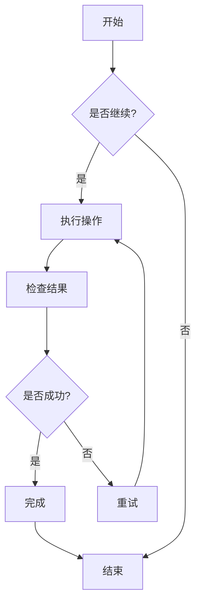
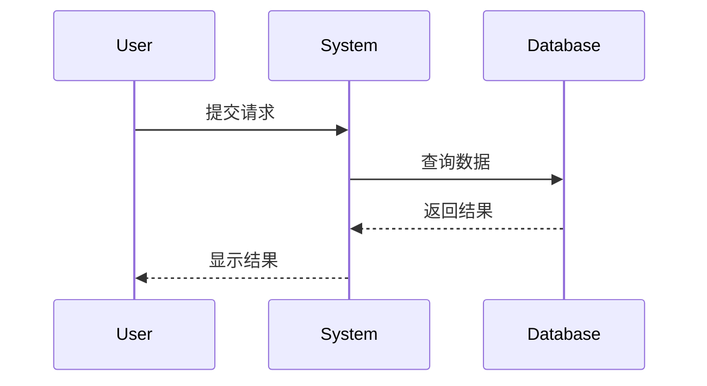
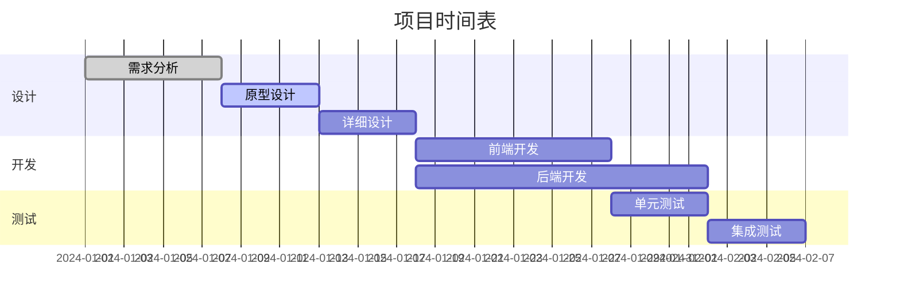
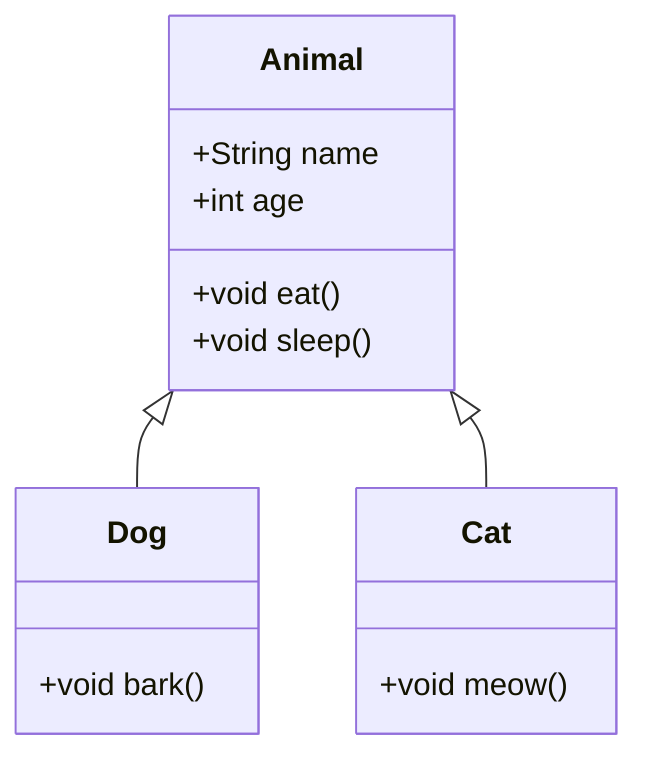
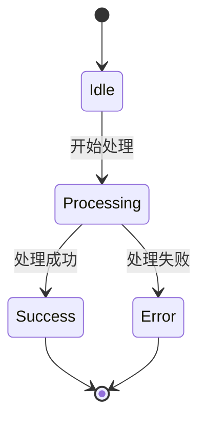
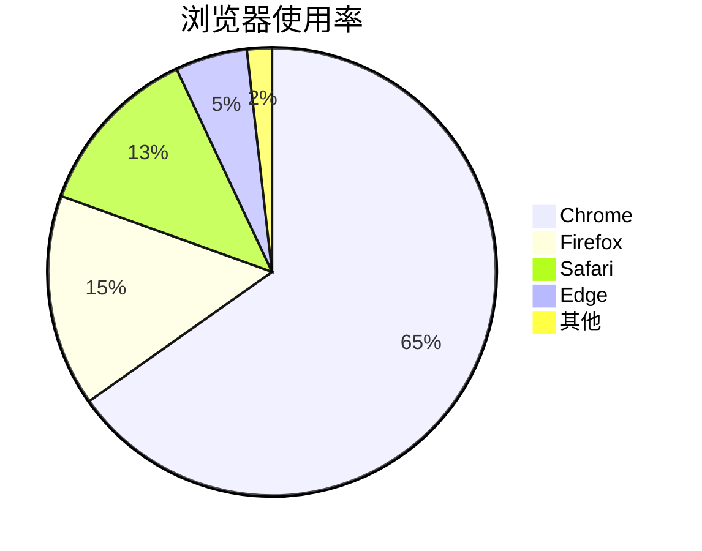

# Mermaid 图表测试

这是一个测试文件，用于验证 CZON 中的 Mermaid 图表渲染功能。

## 流程图示例



## 序列图示例



## 甘特图示例



## 类图示例



## 状态图示例



## 饼图示例



## 错误语法测试（应该显示错误信息）

```mermaid
graph TD
    A --> B
    // 这里缺少箭头定义
    C --> D
```

这个测试文件包含了多种 Mermaid 图表类型，用于验证 CZON 的 Mermaid 集成是否正常工作。
