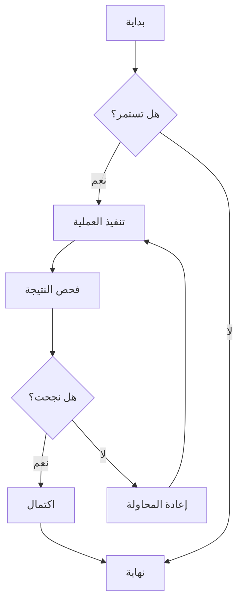
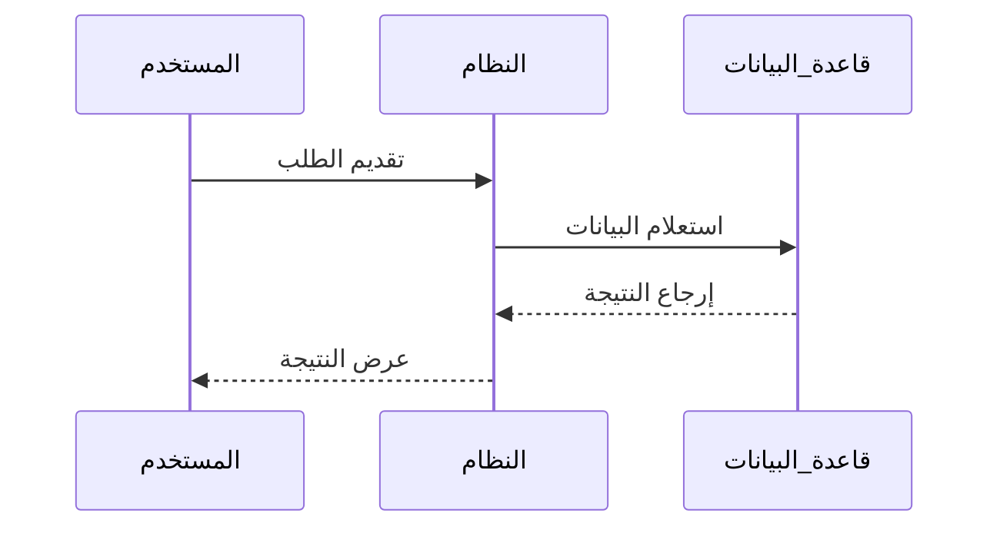
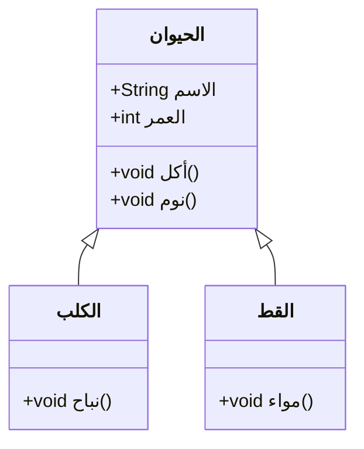
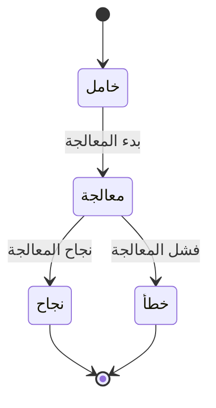
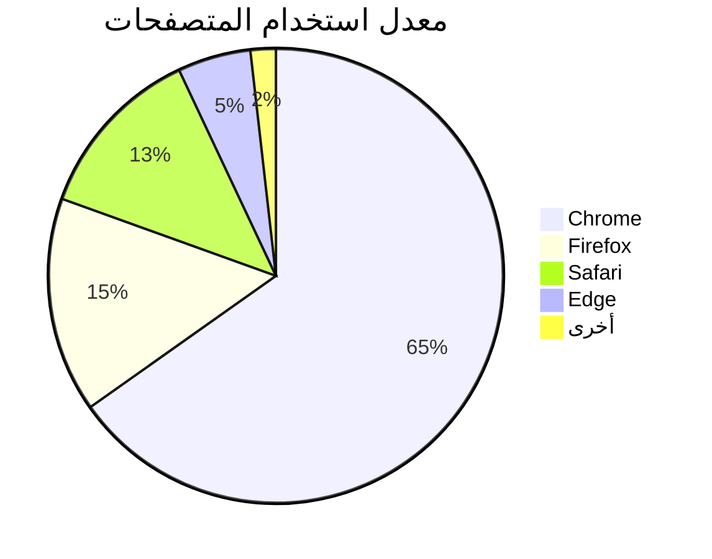

# اختبار مخططات Mermaid

هذا ملف اختبار للتحقق من وظيفة عرض مخططات Mermaid في ZEN.

## مثال على المخطط الانسيابي



## مثال على مخطط التسلسل



## مثال على مخطط جانت

```mermaid
gantt
    title الجدول الزمني للمشروع
    dateFormat  YYYY-MM-DD
    section التصميم
    تحليل المتطلبات     :مكتمل,    des1, 2024-01-01, 7d
    تصميم النموذج الأولي     :نشط,  des2, 2024-01-08, 5d
    التصميم التفصيلي     :         des3, after des2, 5d
    section التطوير
    تطوير الواجهة الأمامية     :         dev1, after des3, 10d
    تطوير الواجهة الخلفية     :         dev2, after des3, 15d
    section الاختبار
    الاختبار الوحدوي     :         test1, after dev1, 5d
    اختبار التكامل     :         test2, after dev2, 5d
```

## مثال على مخطط الفئات



## مثال على مخطط الحالة



## مثال على المخطط الدائري



## اختبار بناء جملة خاطئ (يجب أن يعرض رسالة خطأ)

```mermaid
graph TD
    A --> B
    // هنا تعريف السهم مفقود
    C --> D
```

يحتوي ملف الاختبار هذا على أنواع متعددة من مخططات Mermaid، للتحقق من عمل تكامل Mermaid في ZEN بشكل صحيح.
