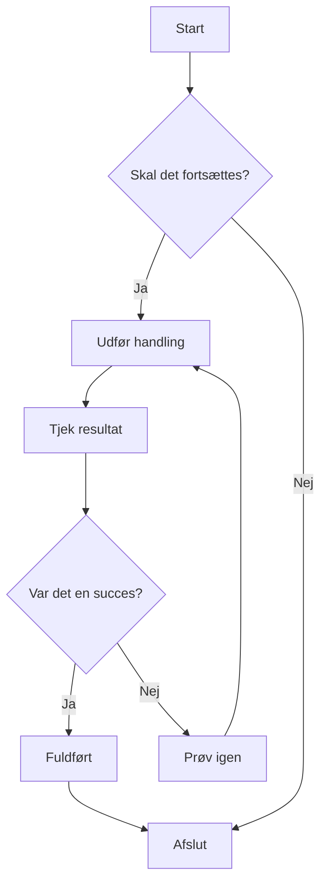
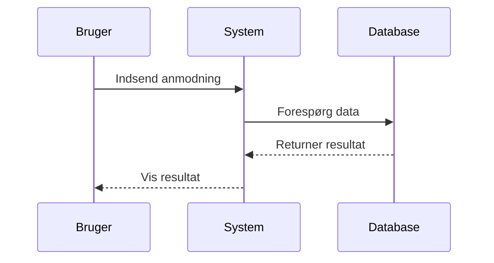
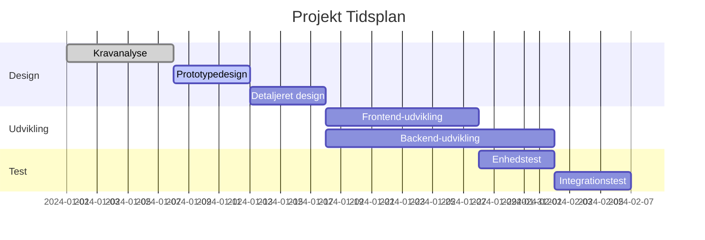
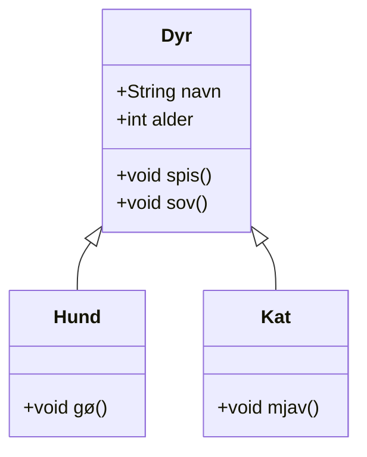
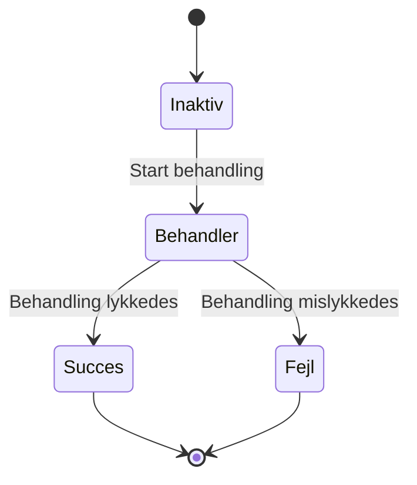
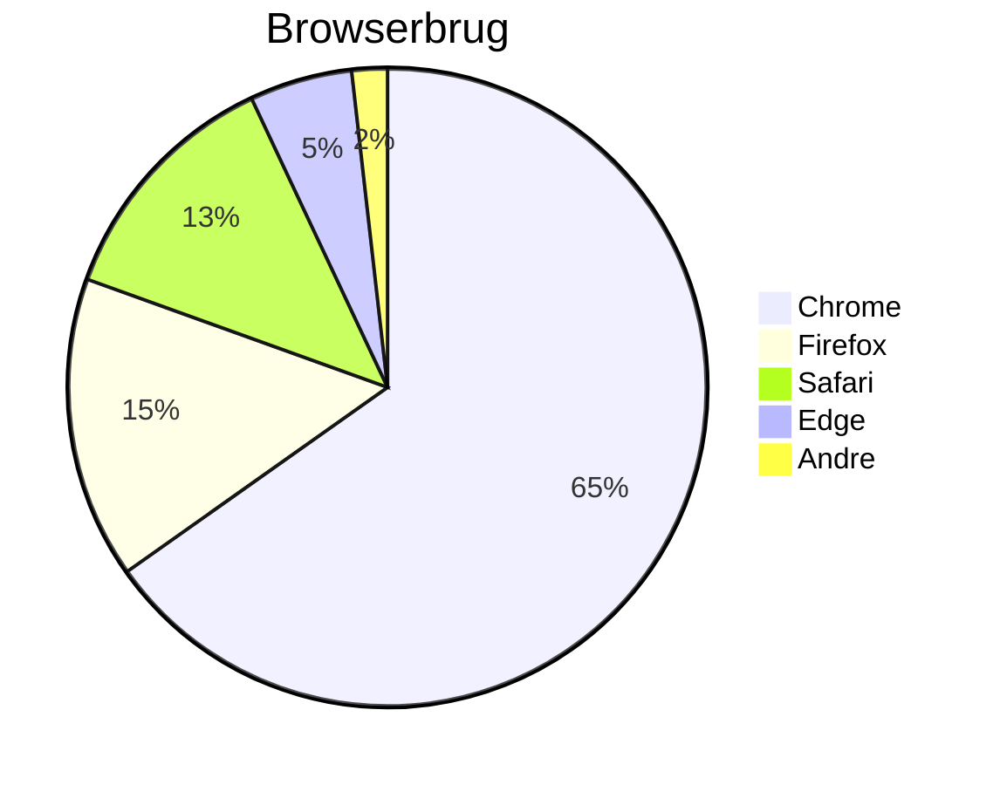

# Mermaid Diagram Test

Dette er en testfil, der bruges til at verificere Mermaid-diagramgengivelsesfunktionen i ZEN.

## Flowdiagram Eksempel



## Sekvensdiagram Eksempel



## Gantt-diagram Eksempel



## Klassediagram Eksempel



## Tilstandsdiagram Eksempel



## Lagkagediagram Eksempel



## Fejl i Syntaks Test (skal vise fejlmeddelelse)

```mermaid
graph TD
    A --> B
    // Her mangler en pildedefinition
    C --> D
```

Denne testfil indeholder flere Mermaid-diagramtyper, der bruges til at verificere, at ZENs Mermaid-integration fungerer korrekt.
