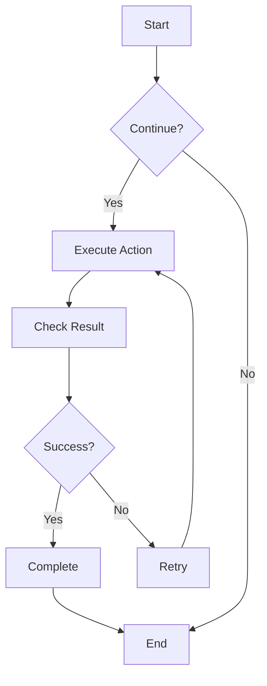
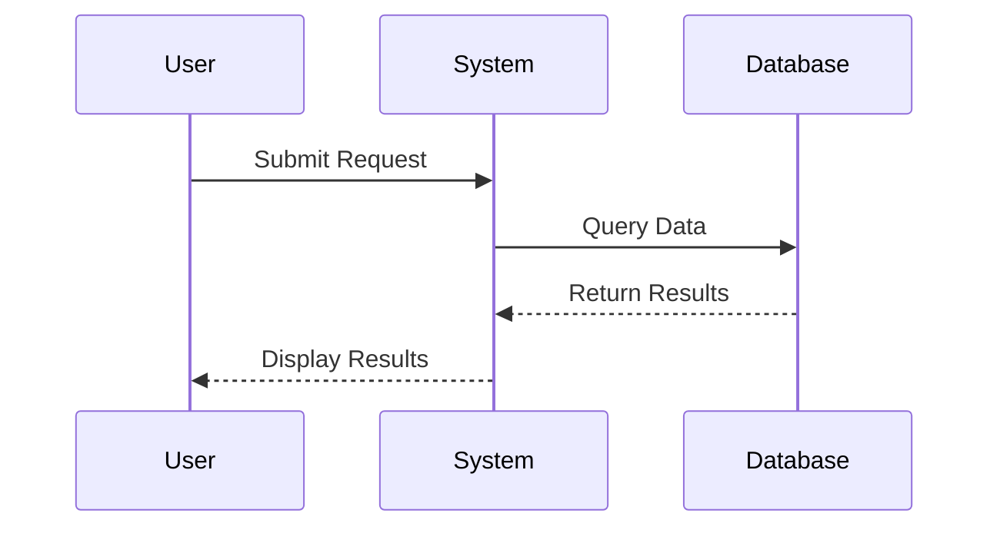
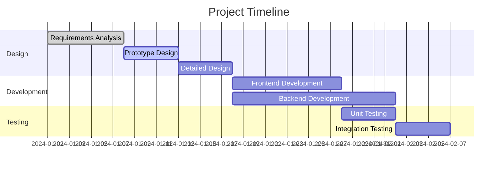
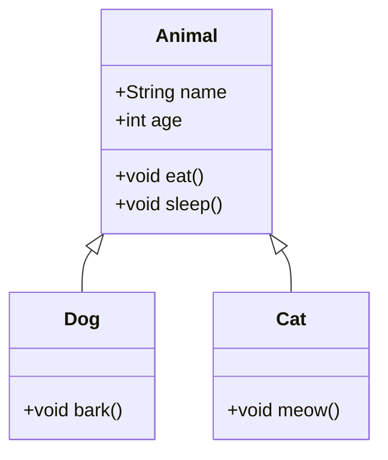
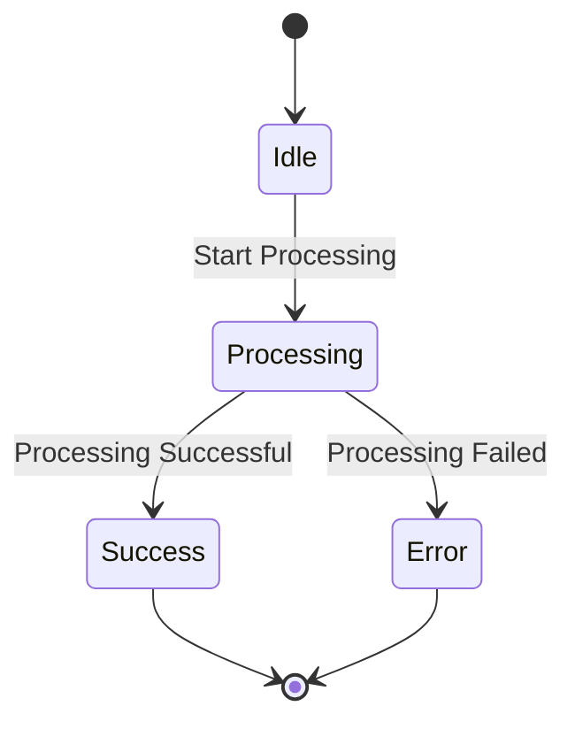
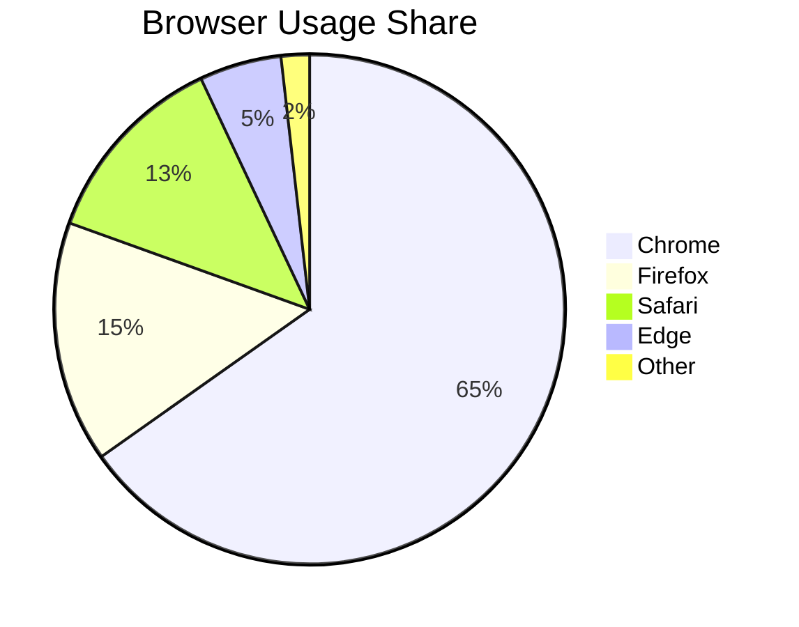

# Mermaid Diagram Test

This is a test file used to verify the Mermaid diagram rendering functionality in ZEN.

## Flowchart Example



## Sequence Diagram Example



## Gantt Chart Example



## Class Diagram Example



## State Diagram Example



## Pie Chart Example



## Error Syntax Test (Should Display Error Message)

```mermaid
graph TD
    A --> B
    // Missing arrow definition here
    C --> D
```

This test file includes various Mermaid diagram types to verify that the Mermaid integration in ZEN is functioning correctly.
