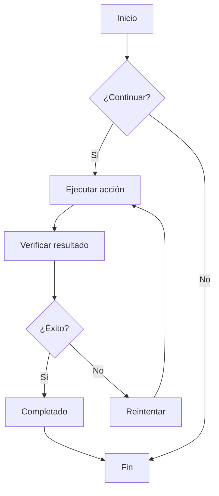
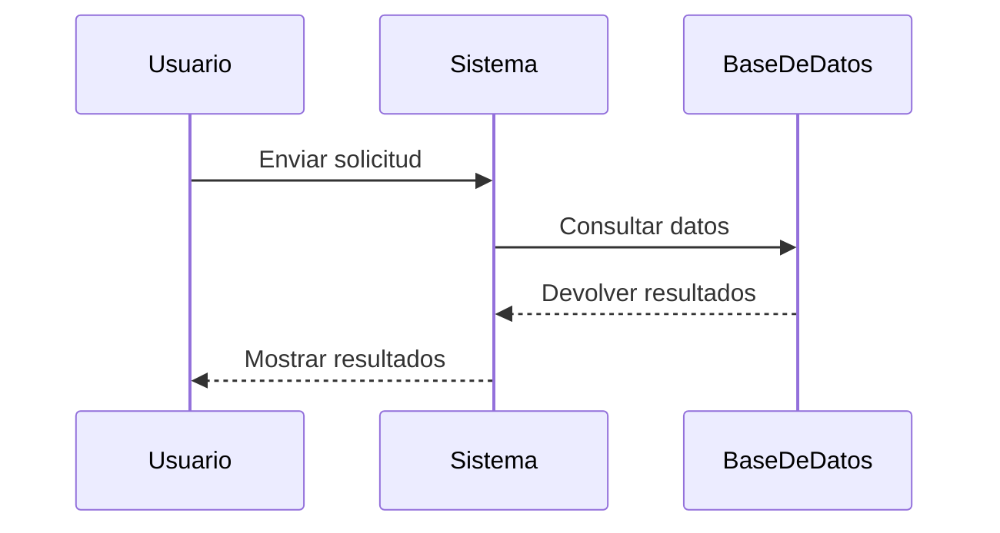
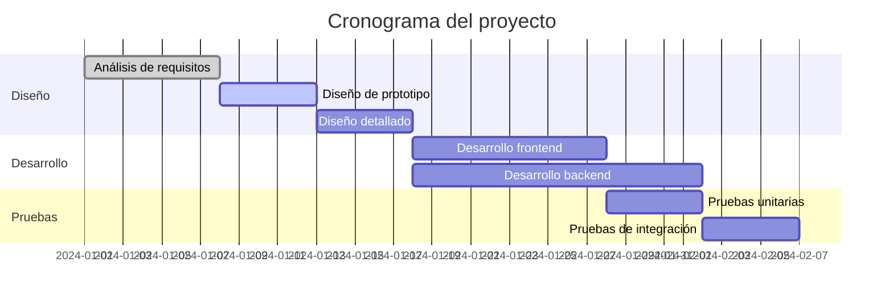
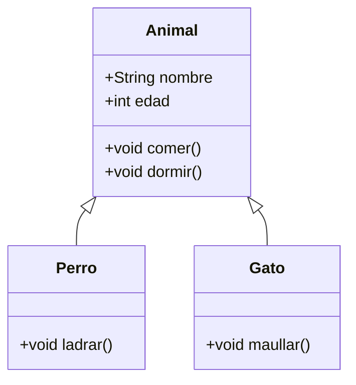
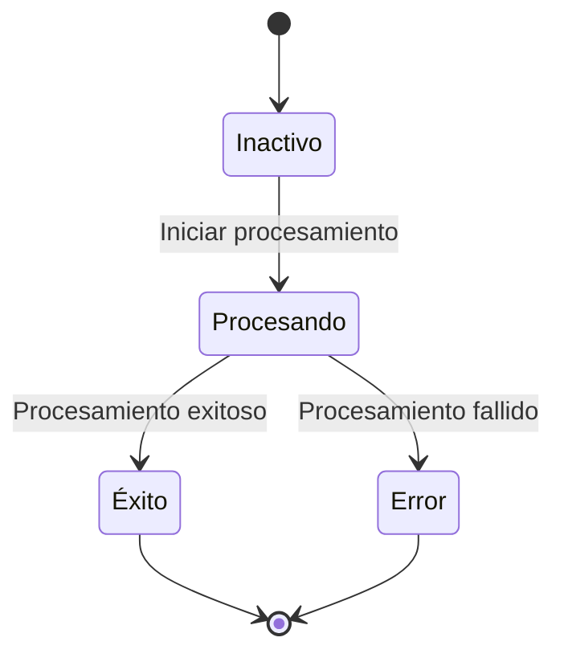
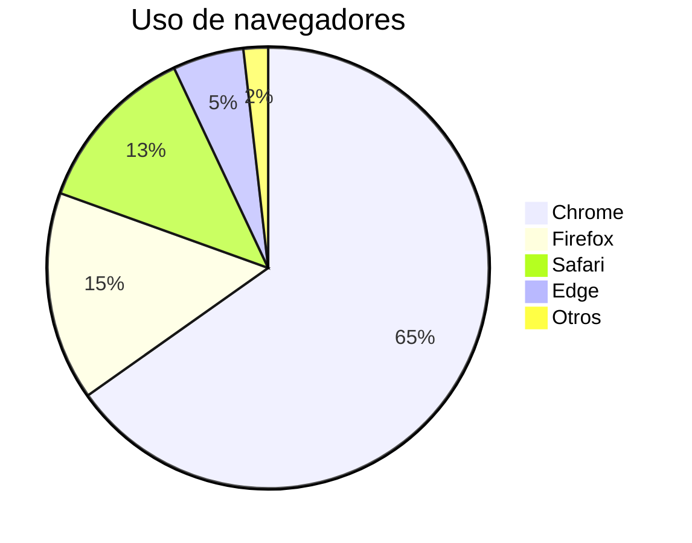

# Prueba de diagramas Mermaid

Este es un archivo de prueba para verificar la funcionalidad de renderizado de diagramas Mermaid en ZEN.

## Ejemplo de diagrama de flujo



## Ejemplo de diagrama de secuencia



## Ejemplo de diagrama de Gantt



## Ejemplo de diagrama de clases



## Ejemplo de diagrama de estado



## Ejemplo de gráfico circular



## Prueba de sintaxis errónea (debe mostrar mensaje de error)

```mermaid
graph TD
    A --> B
    // Aquí falta la definición de flecha
    C --> D
```

Este archivo de prueba incluye varios tipos de diagramas Mermaid para verificar que la integración de Mermaid en ZEN funcione correctamente.
