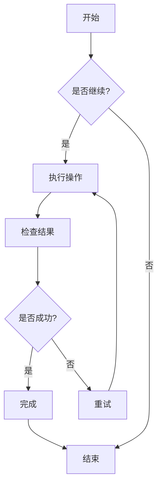
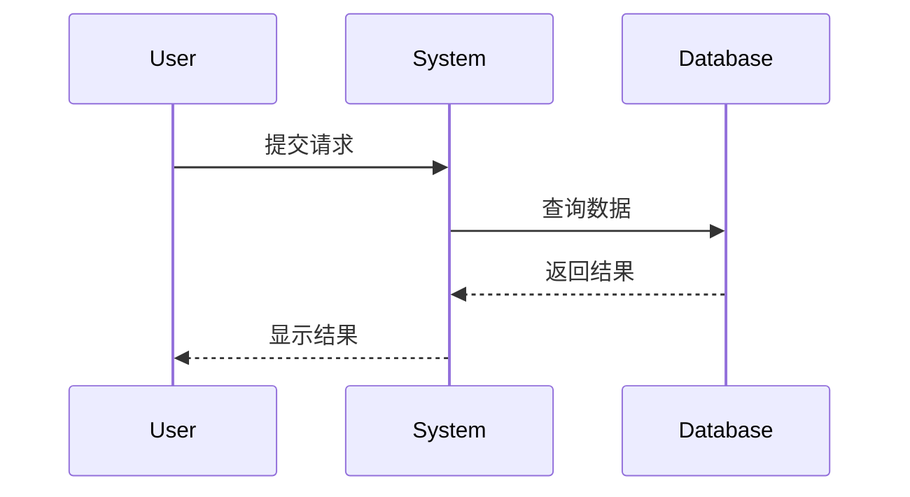
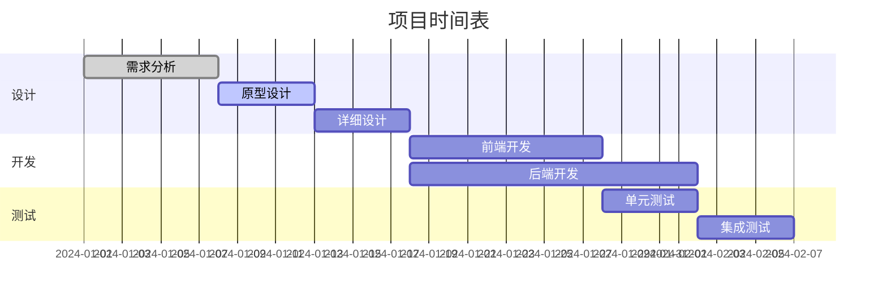
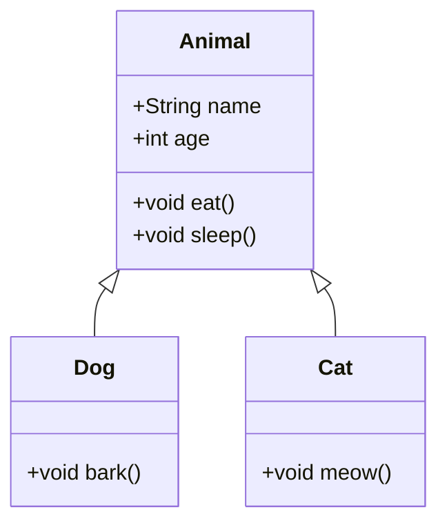
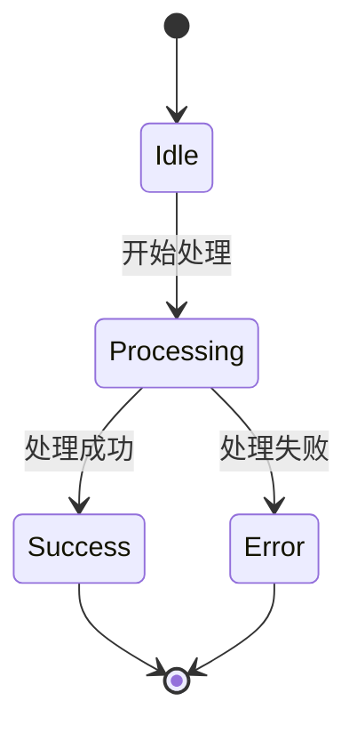
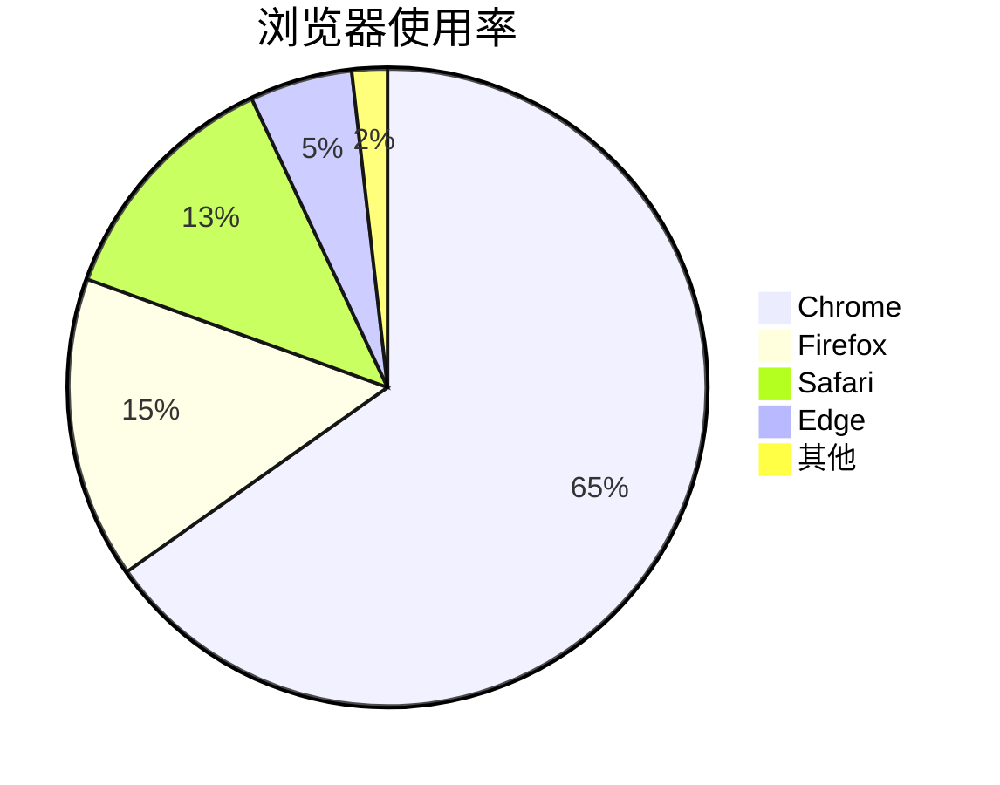

# Mermaid-kaavioiden testaus

Tämä on testitiedosto, jolla varmistetaan Mermaid-kaavioiden renderöintitoiminto ZEN:ssä.

## Esimerkki vuokaaviosta



## Esimerkki sekvenssikaaviosta



## Esimerkki Gantt-kaaviosta



## Esimerkki luokkakaaviosta



## Esimerkki tilakaaviosta



## Esimerkki ympyräkaaviosta



## Virheellisen syntaksin testaus (pitäisi näyttää virheilmoituksen)

```mermaid
graph TD
    A --> B
    // 这里缺少箭头定义
    C --> D
```

Tämä testitiedosto sisältää useita Mermaid-kaaviotyyppejä, joilla varmistetaan ZEN:n Mermaid-integraation oikea toiminta.
