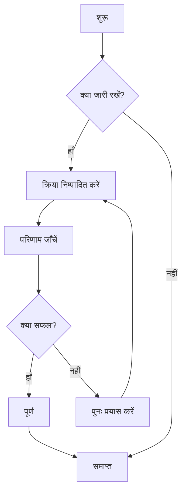
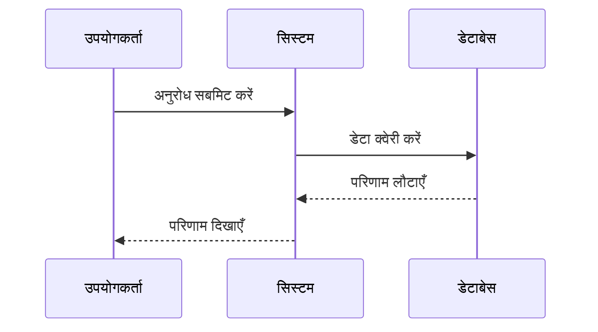
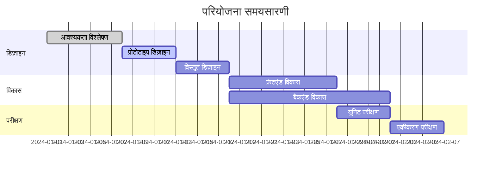
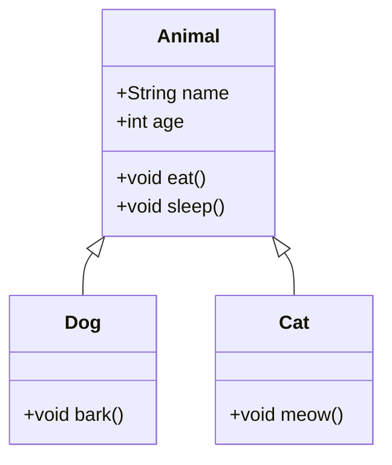
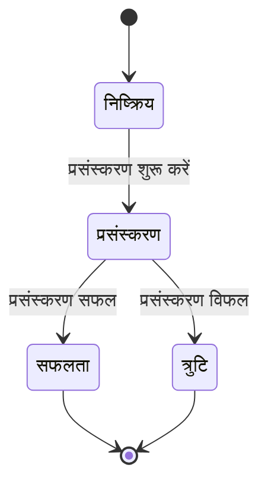
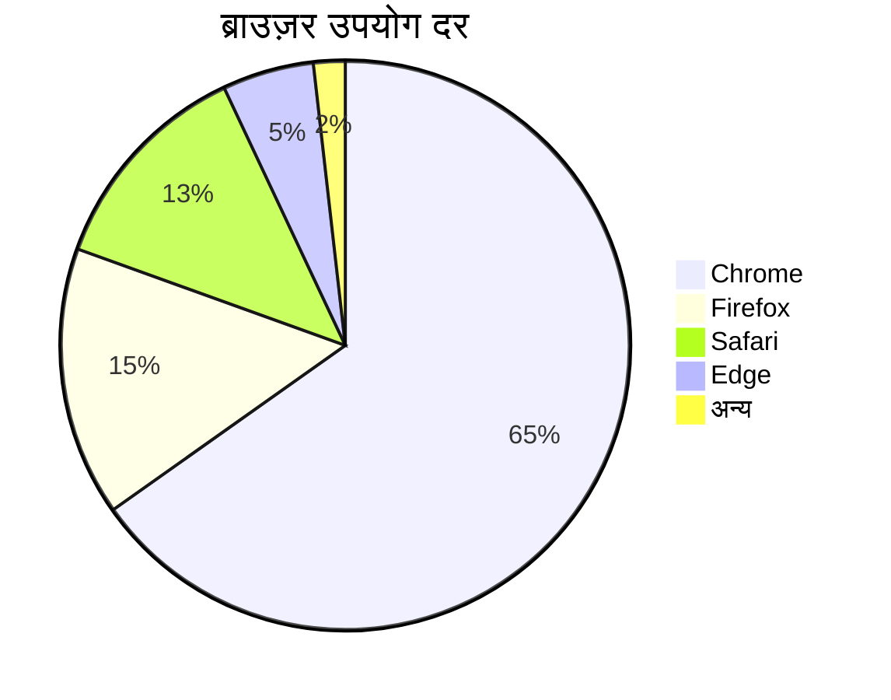

# Mermaid चार्ट परीक्षण

यह ZEN में Mermaid चार्ट रेंडरिंग कार्यक्षमता को सत्यापित करने के लिए एक परीक्षण फ़ाइल है।

## फ़्लोचार्ट उदाहरण



## सीक्वेंस डायग्राम उदाहरण



## गैंट चार्ट उदाहरण



## क्लास डायग्राम उदाहरण



## स्टेट डायग्राम उदाहरण



## पाई चार्ट उदाहरण



## गलत सिंटैक्स परीक्षण (त्रुटि संदेश दिखना चाहिए)

```mermaid
graph TD
    A --> B
    // यहाँ तीर परिभाषा गायब है
    C --> D
```

इस परीक्षण फ़ाइल में विभिन्न प्रकार के Mermaid चार्ट शामिल हैं, जो ZEN में Mermaid एकीकरण के सही कार्य को सत्यापित करने के लिए हैं।
