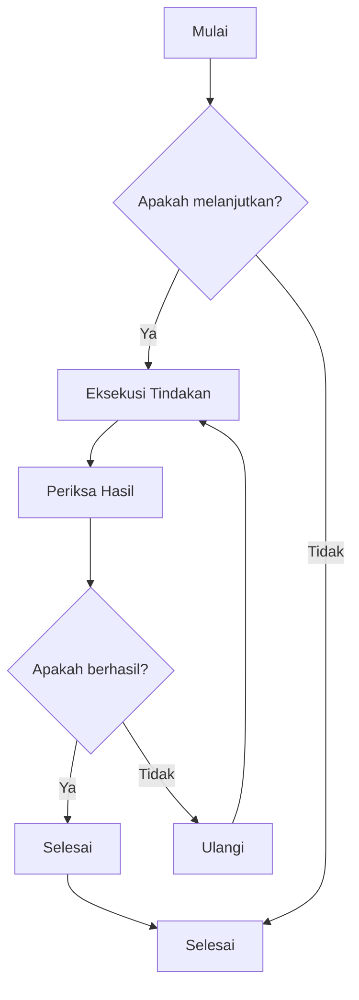
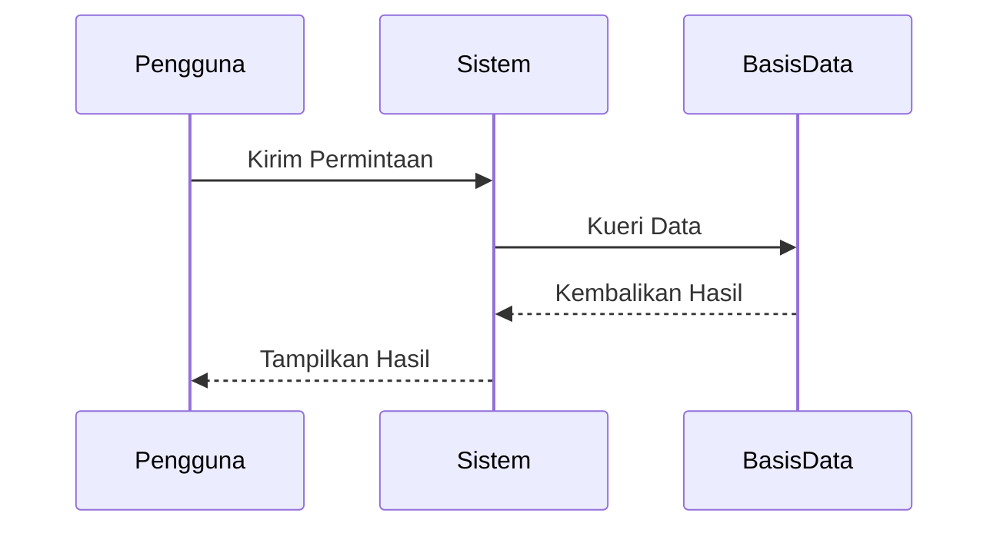
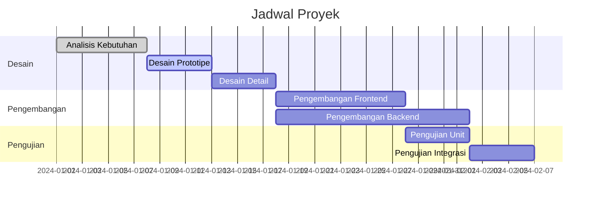
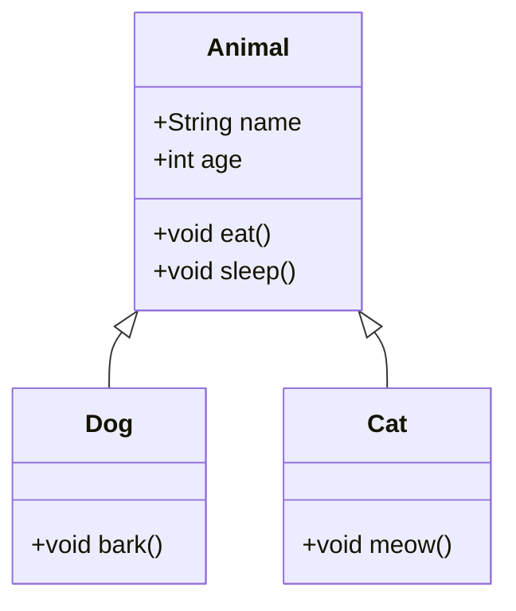
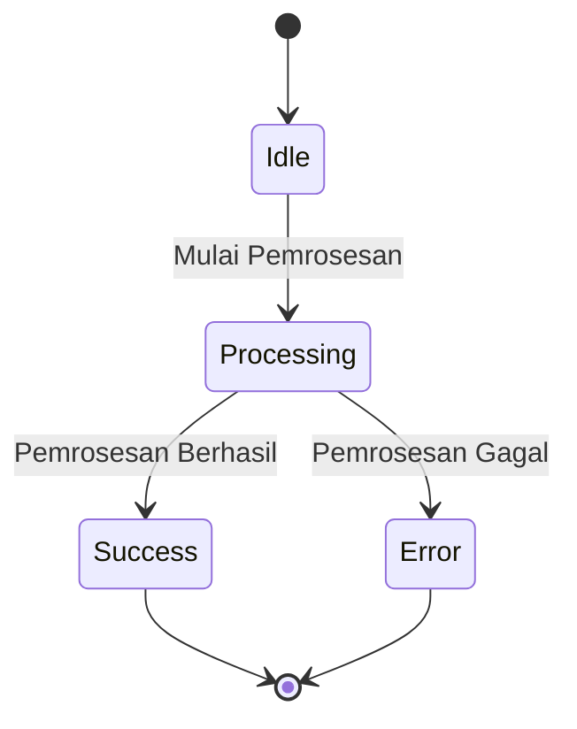
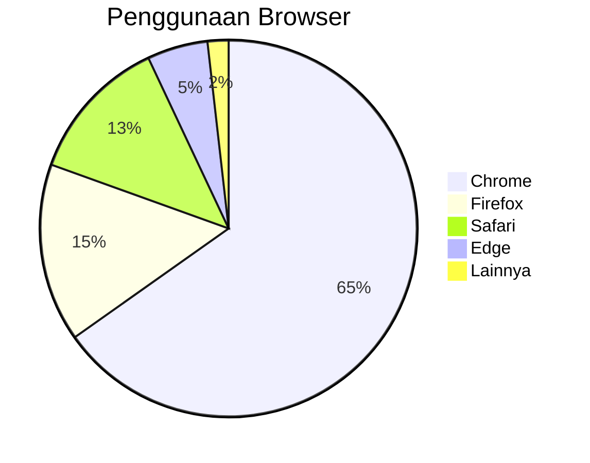

# Pengujian Diagram Mermaid

Ini adalah file pengujian untuk memverifikasi fungsi render diagram Mermaid di ZEN.

## Contoh Diagram Alir



## Contoh Diagram Urutan



## Contoh Diagram Gantt



## Contoh Diagram Kelas



## Contoh Diagram Keadaan



## Contoh Diagram Pai



## Pengujian Sintaksis Salah (Seharusnya Menampilkan Pesan Kesalahan)

```mermaid
graph TD
    A --> B
    // Di sini kurang definisi panah
    C --> D
```

File pengujian ini berisi berbagai jenis diagram Mermaid untuk memverifikasi apakah integrasi Mermaid di ZEN berfungsi normal.
