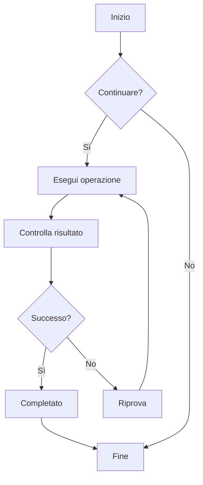
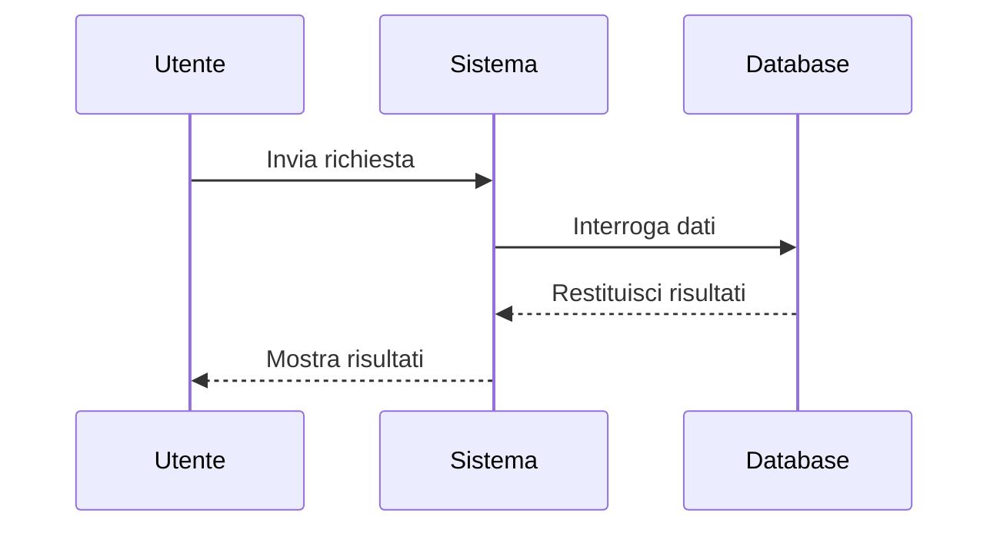
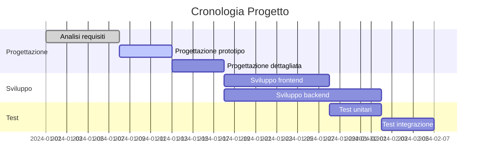
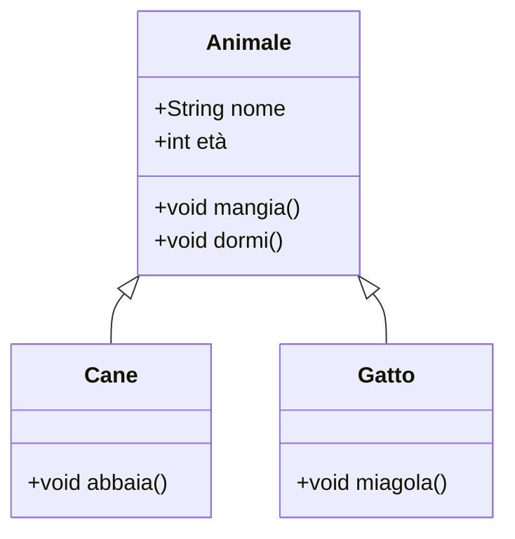
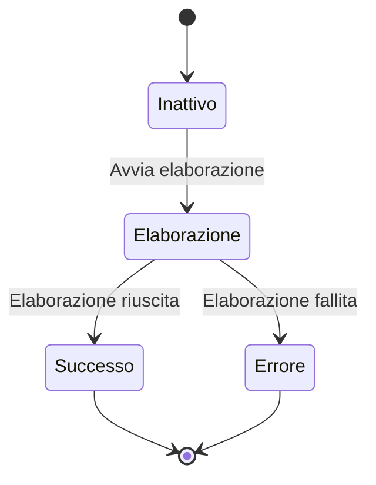
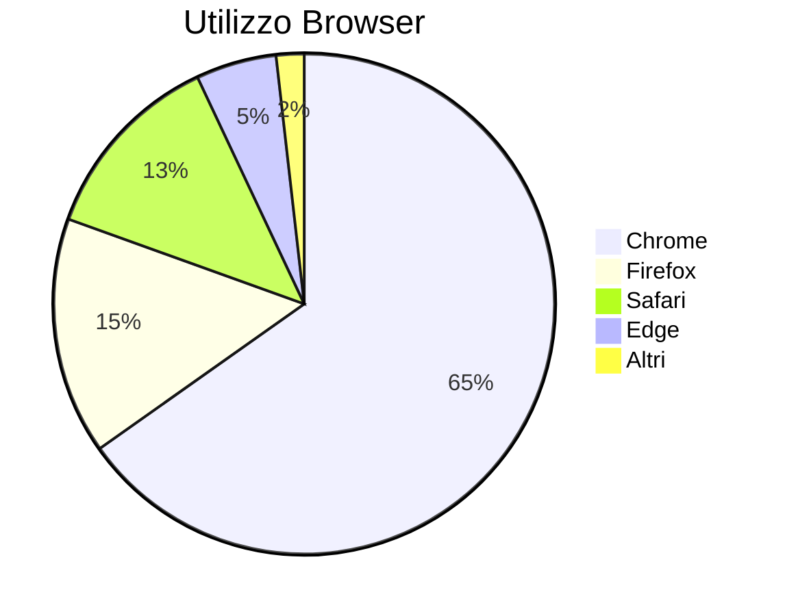

# Test Diagrammi Mermaid

Questo è un file di test per verificare la funzionalità di rendering dei diagrammi Mermaid in ZEN.

## Esempio di Diagramma di Flusso



## Esempio di Diagramma di Sequenza



## Esempio di Diagramma di Gantt



## Esempio di Diagramma delle Classi



## Esempio di Diagramma di Stato



## Esempio di Diagramma a Torta



## Test Sintassi Errata (dovrebbe mostrare un messaggio di errore)

```mermaid
graph TD
    A --> B
    // Qui manca la definizione della freccia
    C --> D
```

Questo file di test include vari tipi di diagrammi Mermaid per verificare che l'integrazione di Mermaid in ZEN funzioni correttamente.
