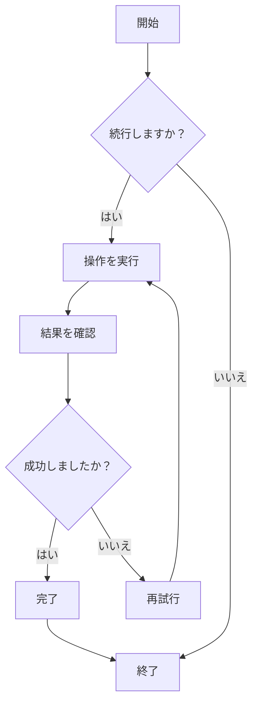
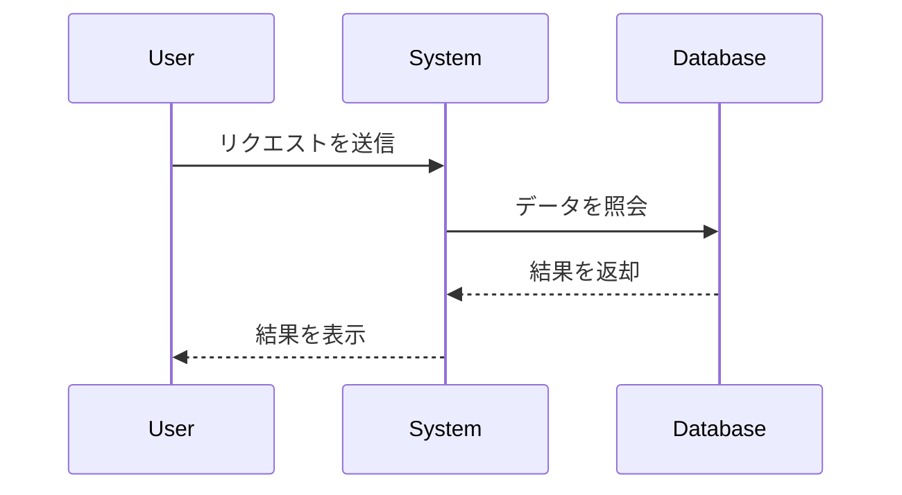
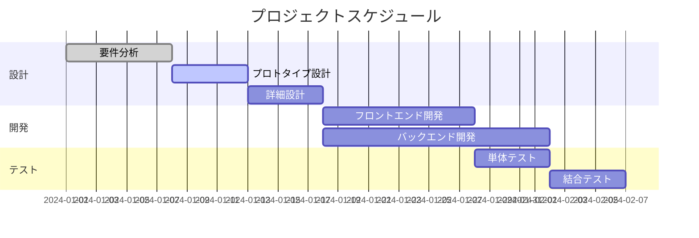
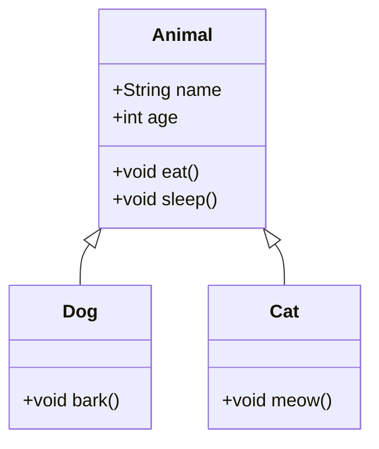
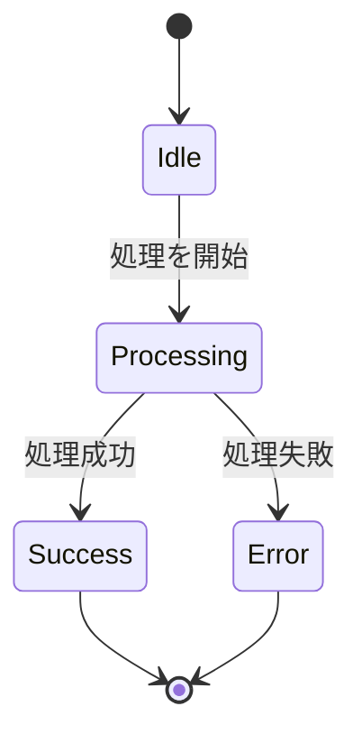
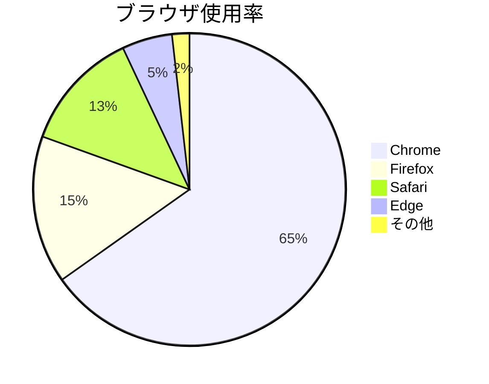

# Mermaid 図表テスト

これは、ZENにおけるMermaid図表レンダリング機能を検証するためのテストファイルです。

## フローチャート例



## シーケンス図例



## ガントチャート例



## クラス図例



## 状態図例



## 円グラフ例



## 誤った構文テスト（エラーメッセージが表示されるはず）

```mermaid
graph TD
    A --> B
    // ここに矢印の定義が不足しています
    C --> D
```

このテストファイルは、ZENのMermaid統合が正常に動作することを検証するために、様々なMermaid図表タイプを含んでいます。
