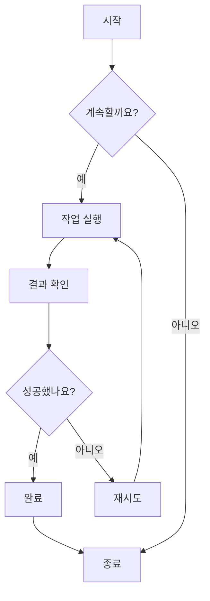
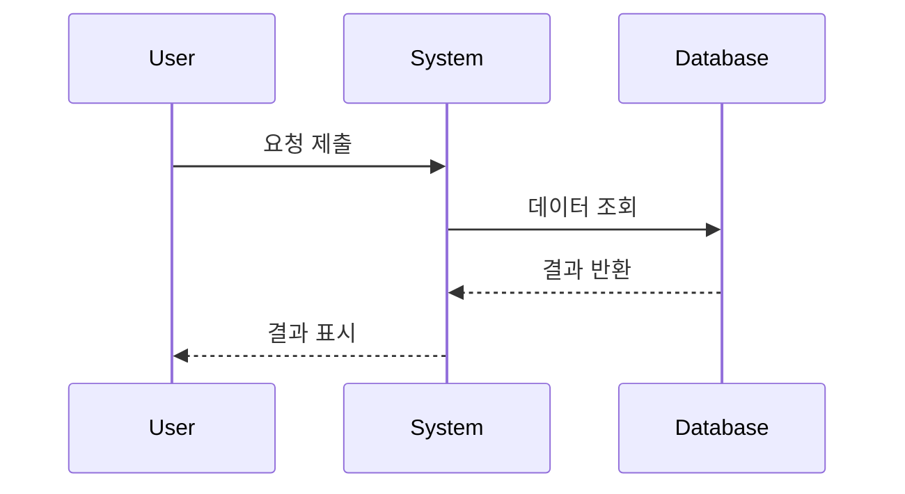
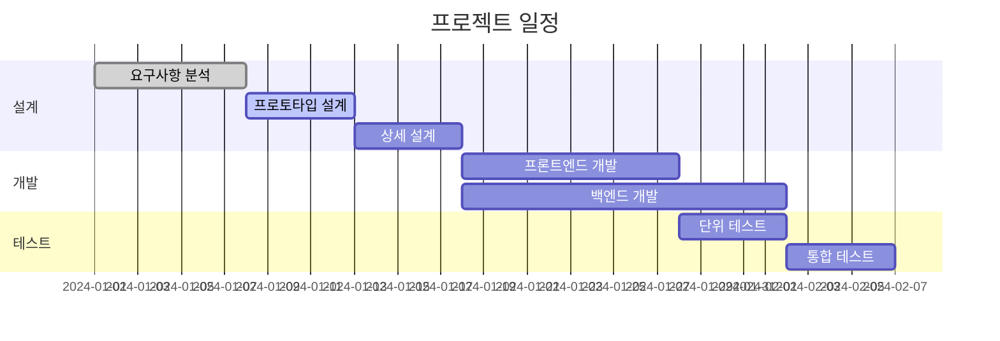
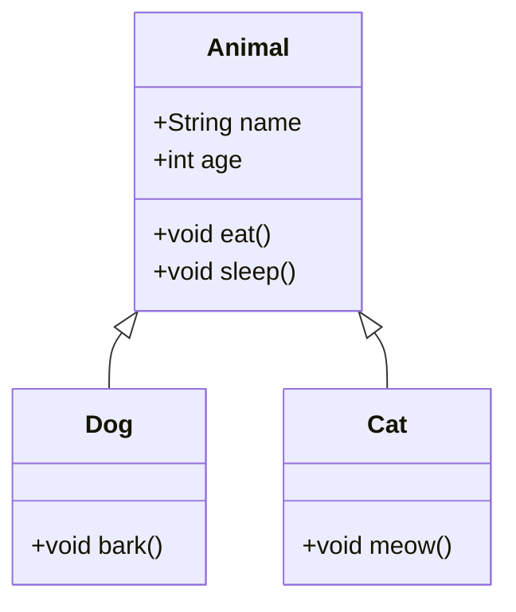
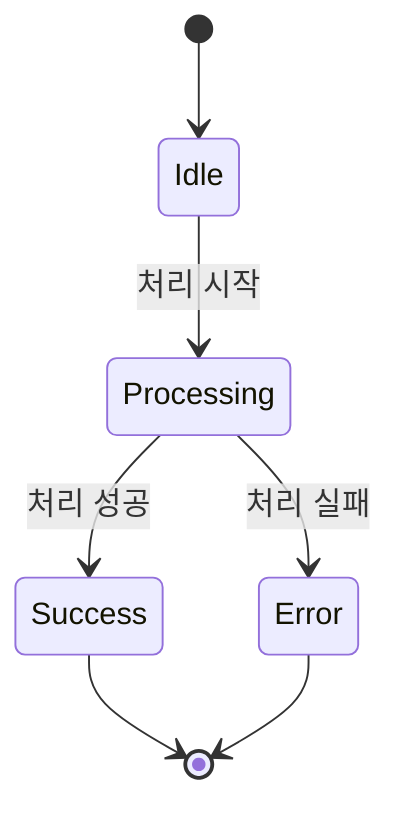
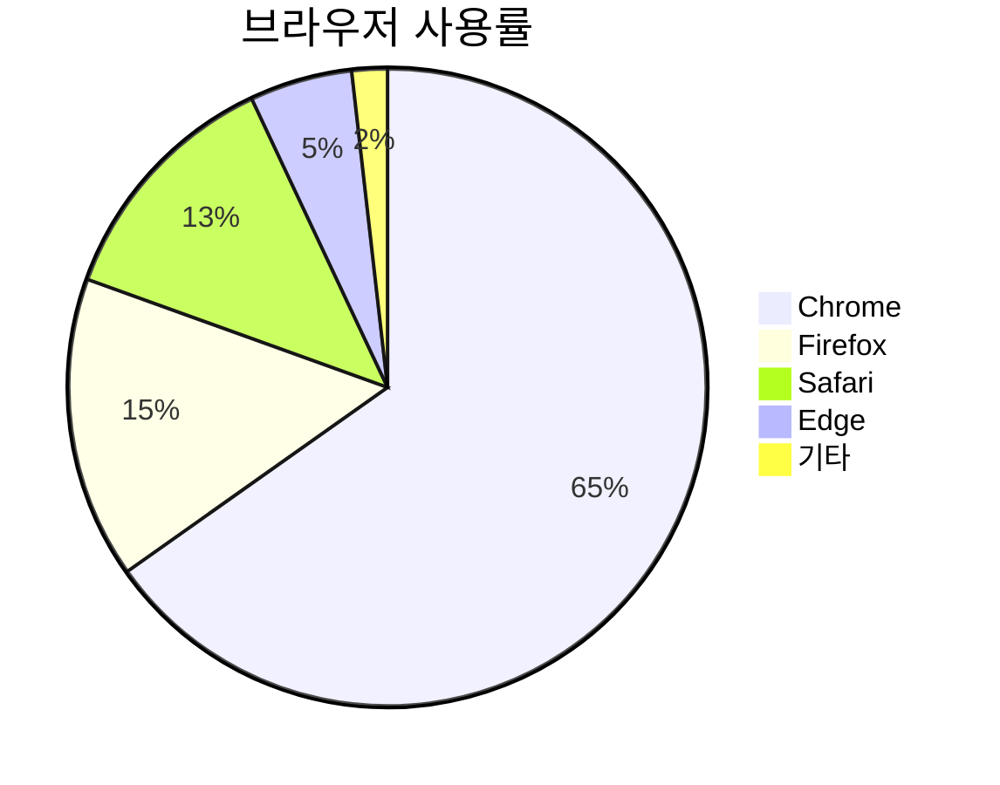

# Mermaid 차트 테스트

이 파일은 ZEN에서의 Mermaid 차트 렌더링 기능을 검증하기 위한 테스트 파일입니다.

## 플로우차트 예시



## 시퀀스 다이어그램 예시



## 간트 차트 예시



## 클래스 다이어그램 예시



## 상태 다이어그램 예시



## 파이 차트 예시



## 잘못된 구문 테스트 (오류 메시지가 표시되어야 함)

```mermaid
graph TD
    A --> B
    // 여기에 화살표 정의가 누락됨
    C --> D
```

이 테스트 파일은 ZEN의 Mermaid 통합이 정상적으로 작동하는지 검증하기 위해 다양한 Mermaid 차트 유형을 포함하고 있습니다.
