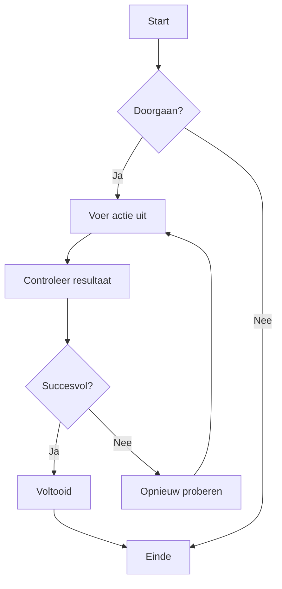
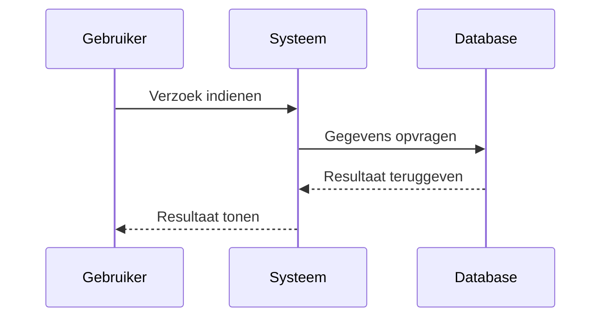
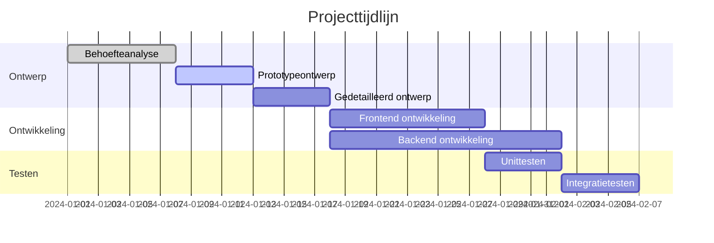
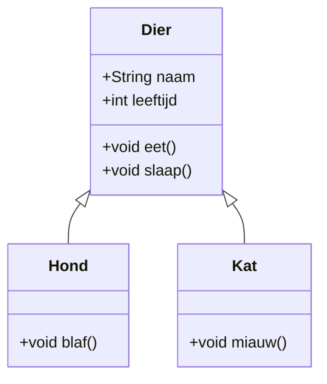
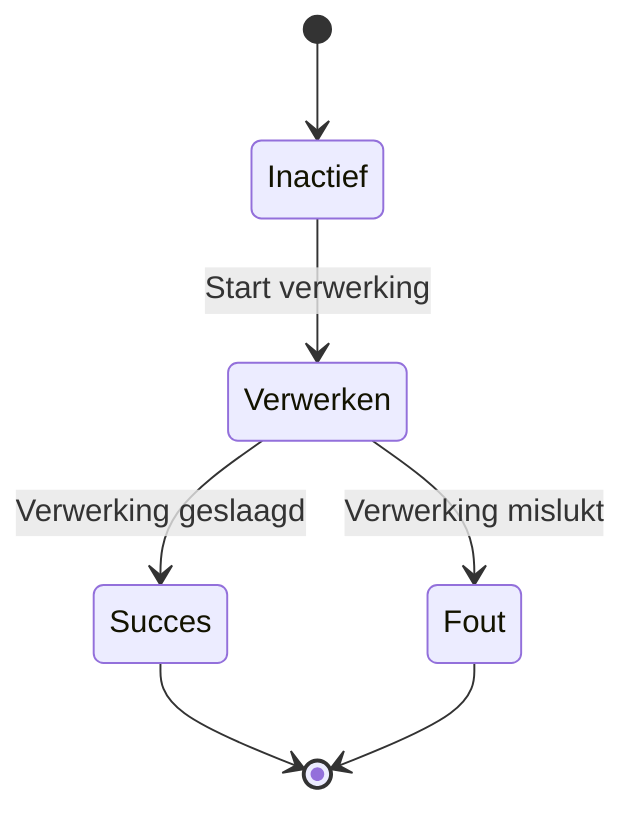
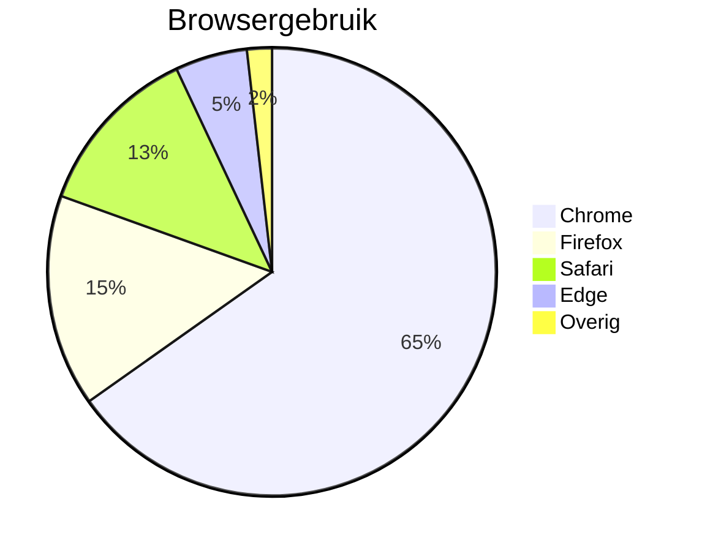

# Mermaid Diagram Test

Dit is een testbestand om de Mermaid-diagramweergavefunctionaliteit in ZEN te valideren.

## Stroomdiagram Voorbeeld



## Sequentiediagram Voorbeeld



## Gantt-diagram Voorbeeld



## Klassendiagram Voorbeeld



## Toestandsdiagram Voorbeeld



## Taartdiagram Voorbeeld



## Foutieve Syntaxis Test (moet foutmelding tonen)

```mermaid
graph TD
    A --> B
    // Hier ontbreekt pijldefinitie
    C --> D
```

Dit testbestand bevat verschillende Mermaid-diagramtypen om te valideren of de Mermaid-integratie in ZEN correct werkt.
