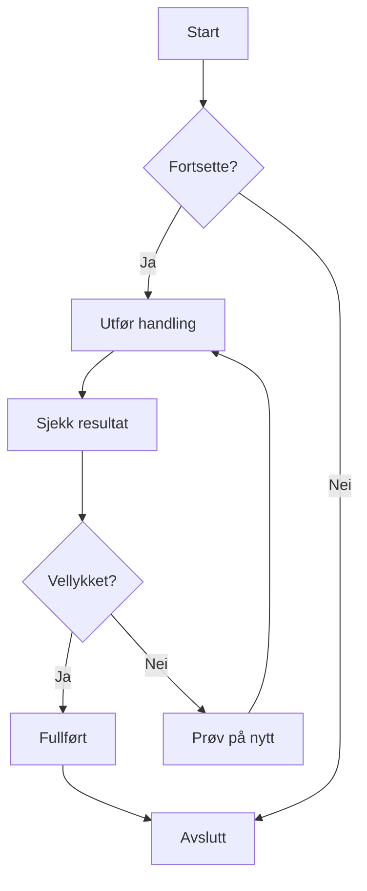
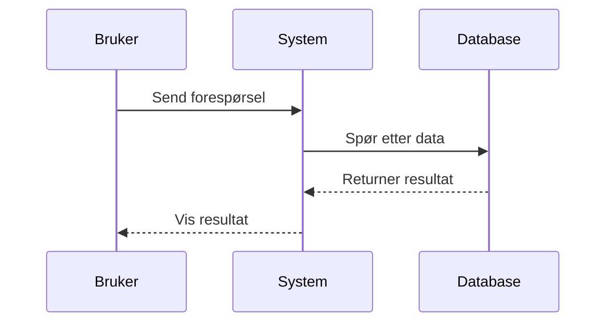
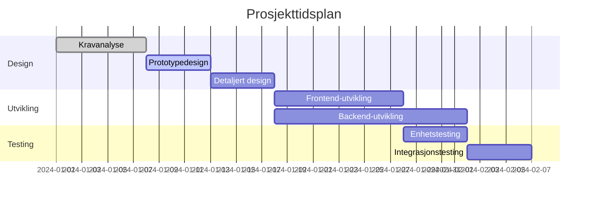
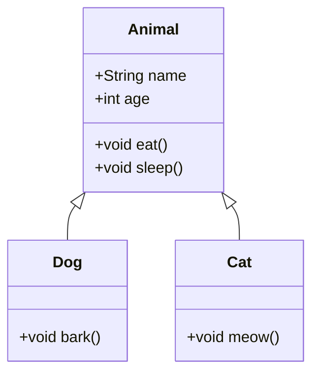
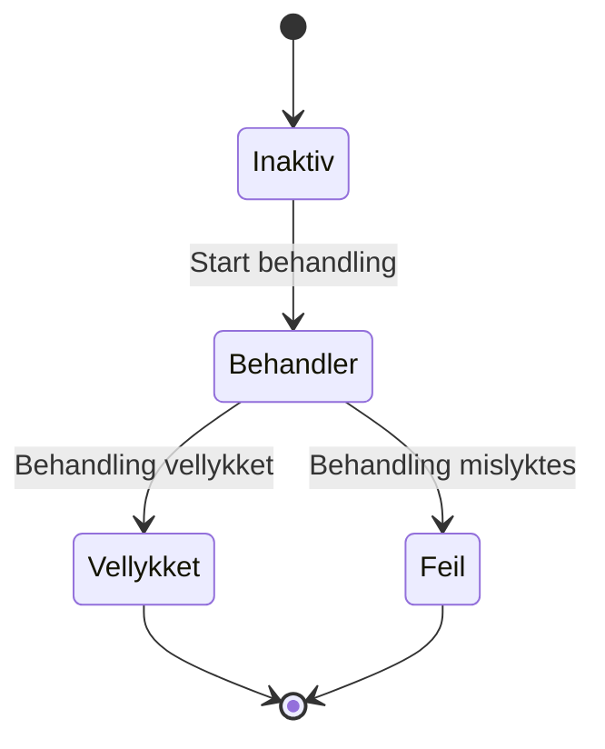
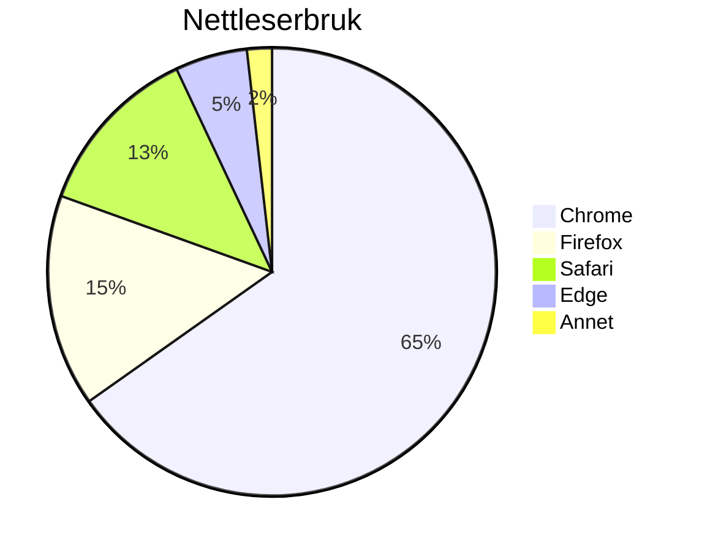

# Mermaid-diagramtesting

Dette er en testfil for å validere Mermaid-diagramgjengivelsesfunksjonen i ZEN.

## Eksempel på flytskjema



## Eksempel på sekvensdiagram



## Eksempel på Gantt-diagram



## Eksempel på klassediagram



## Eksempel på tilstandsdiagram



## Eksempel på kakediagram



## Testsyntaksfeil (skal vise feilmelding)

```mermaid
graph TD
    A --> B
    // Mangler pildedefinisjon her
    C --> D
```

Denne testfilen inneholder flere Mermaid-diagramtyper for å validere at Mermaid-integrasjonen i ZEN fungerer som forventet.
