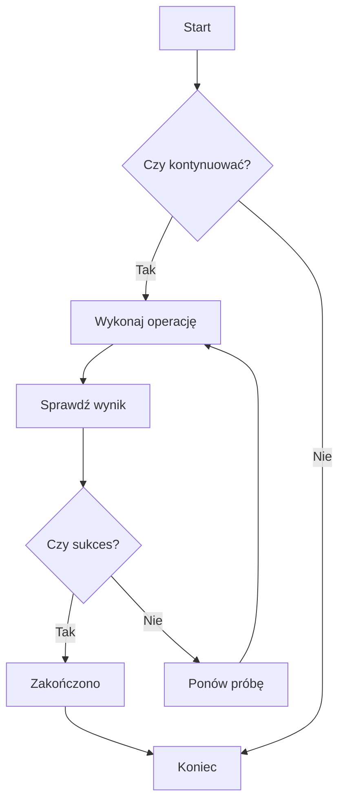
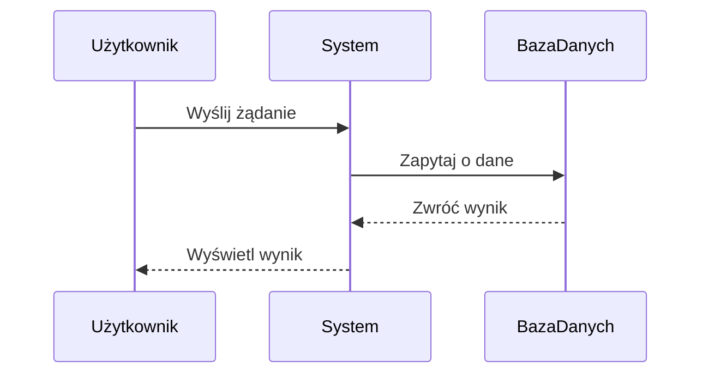
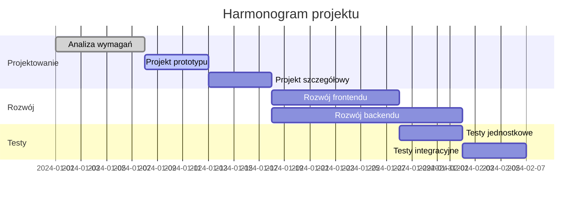
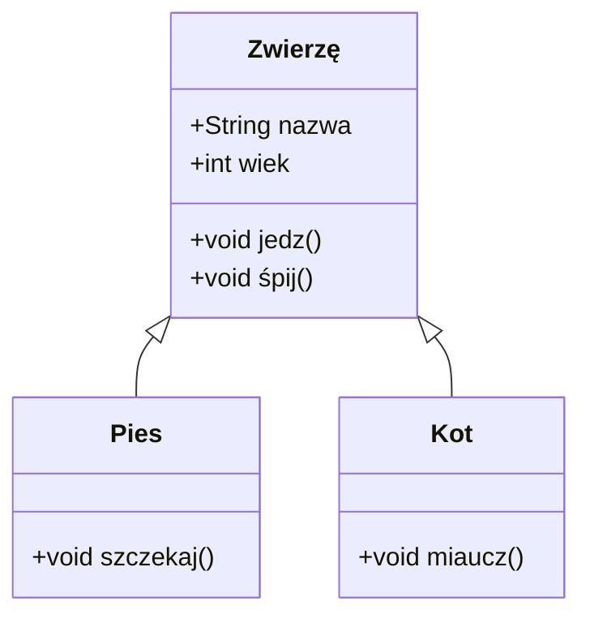
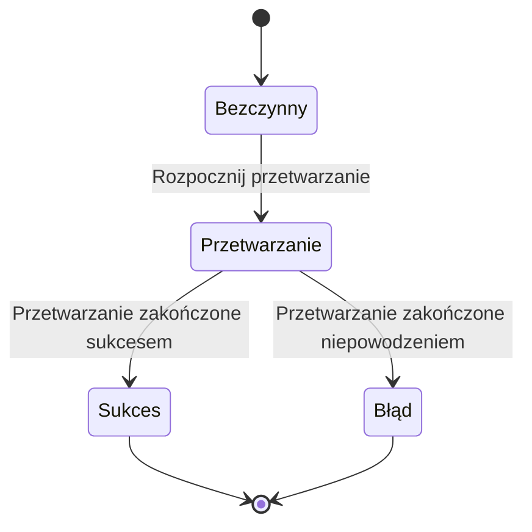
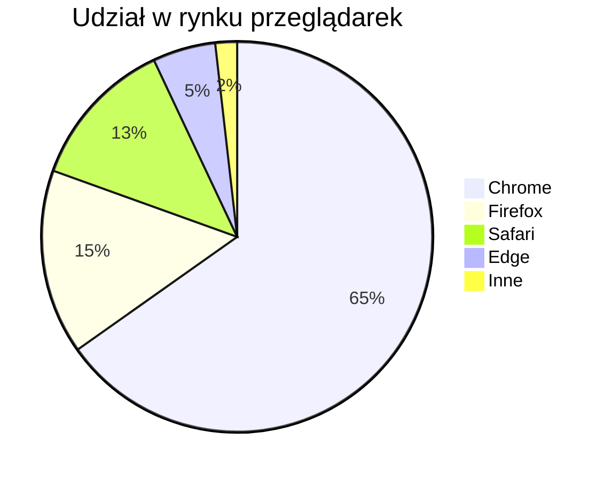

# Test diagramów Mermaid

To jest plik testowy służący do weryfikacji funkcji renderowania diagramów Mermaid w ZEN.

## Przykład schematu blokowego



## Przykład diagramu sekwencji



## Przykład diagramu Gantta



## Przykład diagramu klas



## Przykład diagramu stanów



## Przykład wykresu kołowego



## Test błędnej składni (powinien wyświetlić komunikat o błędzie)

```mermaid
graph TD
    A --> B
    // Brak definicji strzałki
    C --> D
```

Ten plik testowy zawiera różne typy diagramów Mermaid, służące do weryfikacji, czy integracja Mermaid w ZEN działa poprawnie.
