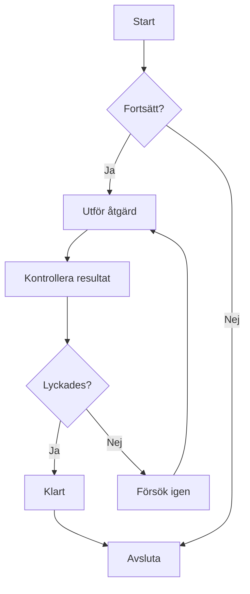
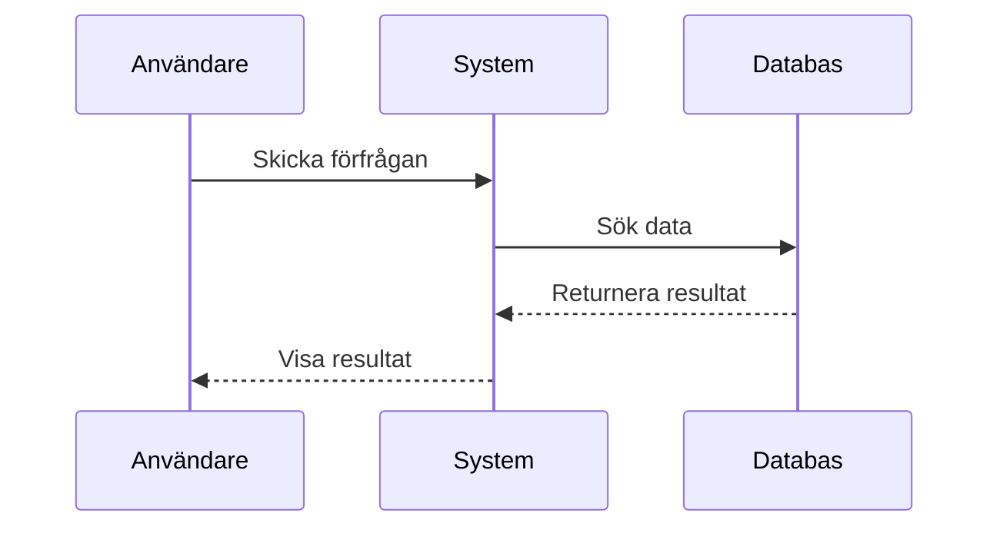
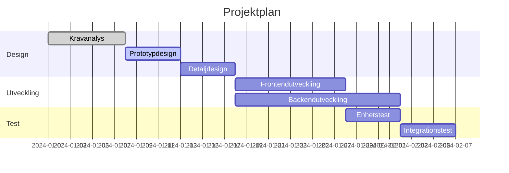
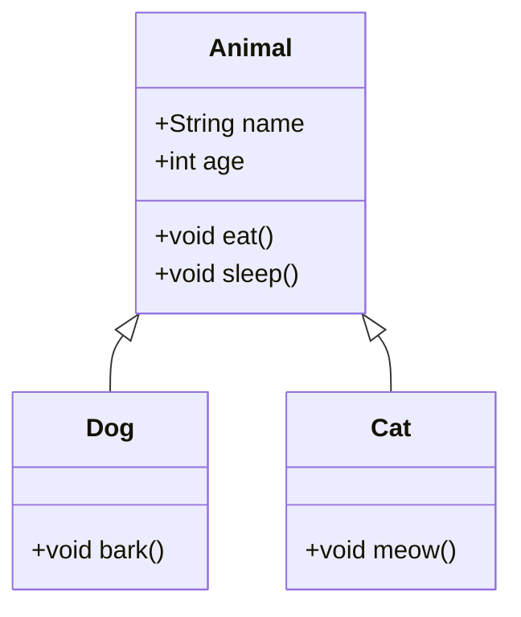
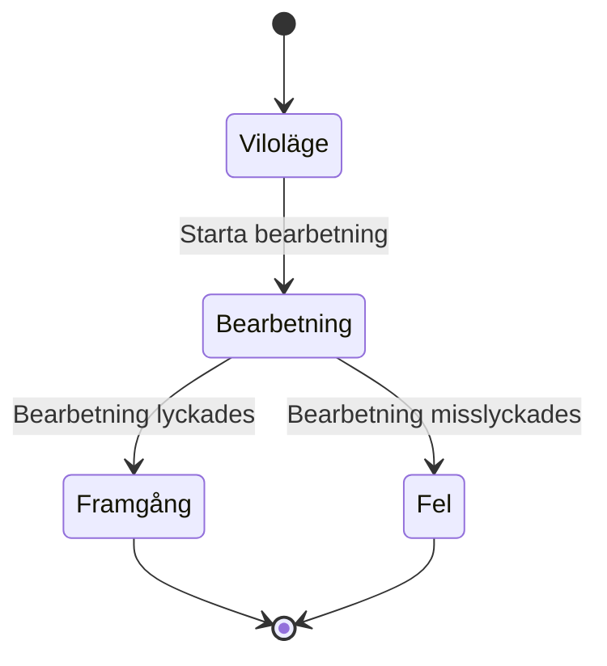
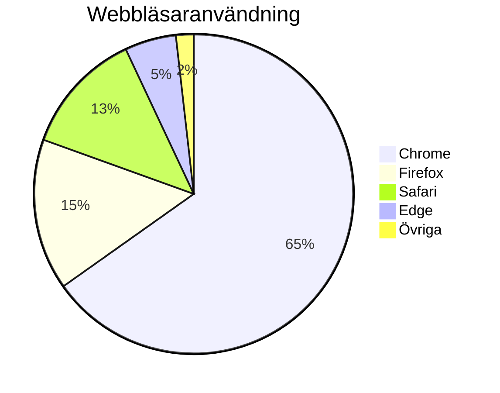

# Mermaid-diagramtest

Detta är en testfil för att verifiera Mermaid-diagramrendering i ZEN.

## Exempel på flödesschema



## Exempel på sekvensdiagram



## Exempel på Gantt-schema



## Exempel på klassdiagram



## Exempel på tillståndsdiagram



## Exempel på cirkeldiagram



## Test av felaktig syntax (borde visa felmeddelande)

```mermaid
graph TD
    A --> B
    // Här saknas pildefinition
    C --> D
```

Denna testfil innehåller flera Mermaid-diagramtyper för att verifiera att ZEN:s Mermaid-integration fungerar korrekt.
