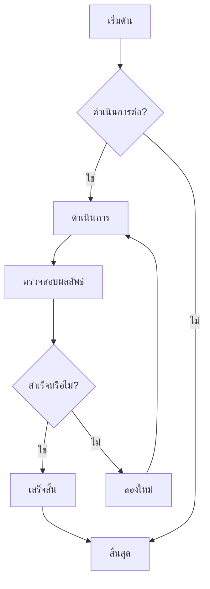
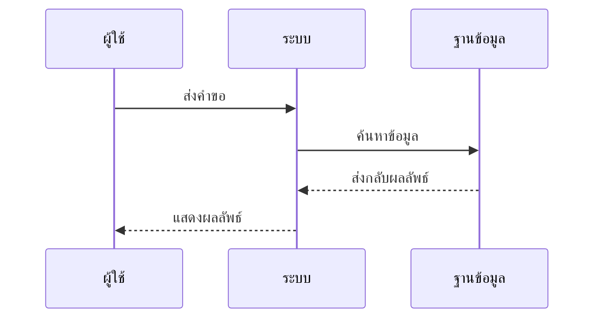
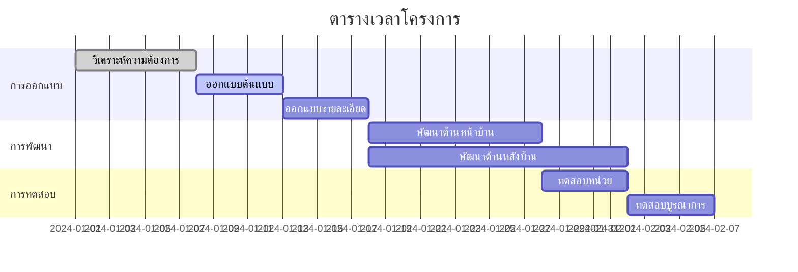
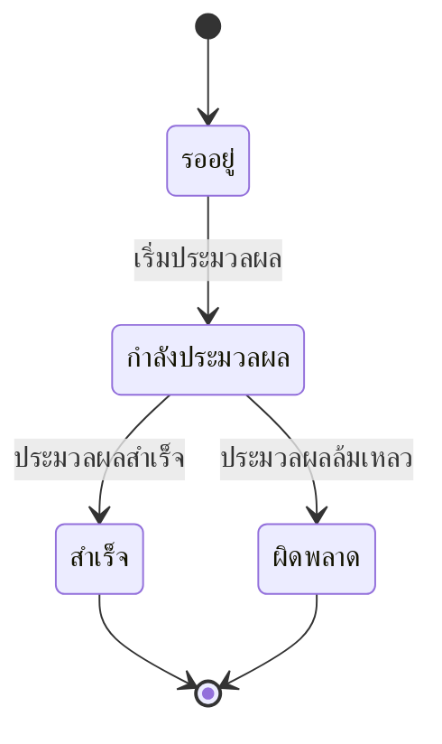
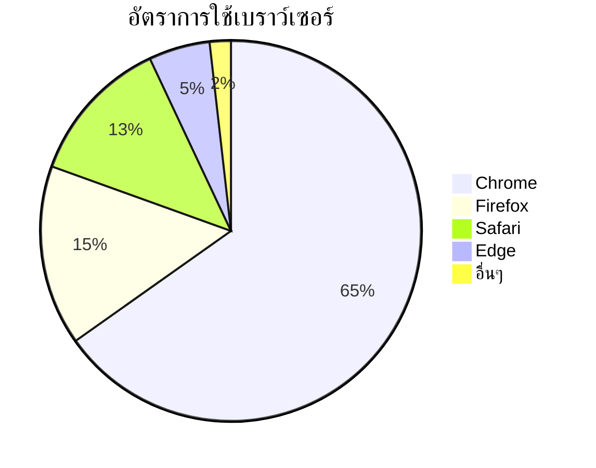

# การทดสอบไดอะแกรม Mermaid

นี่คือไฟล์ทดสอบสำหรับตรวจสอบความสามารถในการแสดงผลไดอะแกรม Mermaid ใน ZEN

## ตัวอย่างโฟลว์ชาร์ต



## ตัวอย่างไดอะแกรมลำดับ



## ตัวอย่างแกนต์ชาร์ต



## ตัวอย่างไดอะแกรมคลาส

```mermaid
classDiagram
    class สัตว์ {
        +String ชื่อ
        +int อายุ
        +void กิน()
        +void นอน()
    }
    class สุนัข {
        +void เห่า()
    }
    class แมว {
        +void ร้อง()
    }

    สัตว์ <|-- สุนัข
    สัตว์ <|-- แมว
```

## ตัวอย่างไดอะแกรมสถานะ



## ตัวอย่างแผนภูมิวงกลม



## การทดสอบไวยากรณ์ผิดพลาด (ควรแสดงข้อความผิดพลาด)

```mermaid
graph TD
    A --> B
    // ขาดการกำหนดลูกศรที่นี่
    C --> D
```

ไฟล์ทดสอบนี้ประกอบด้วยไดอะแกรม Mermaid หลายประเภท เพื่อตรวจสอบว่าการผสานรวม Mermaid ใน ZEN ทำงานได้ปกติ
