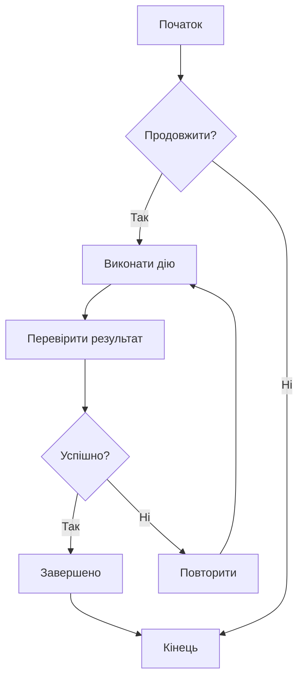
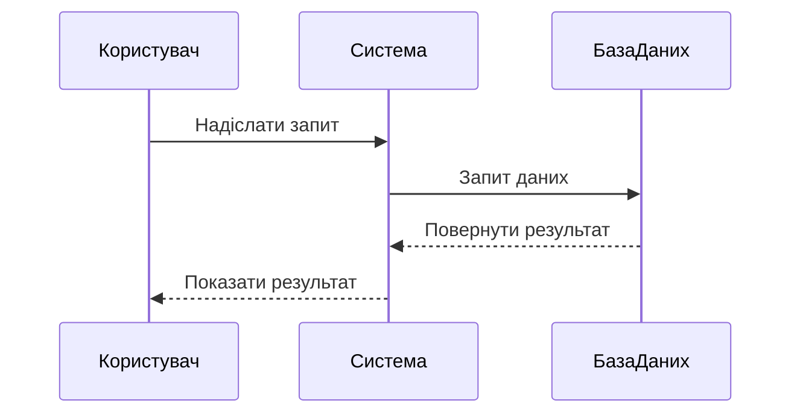
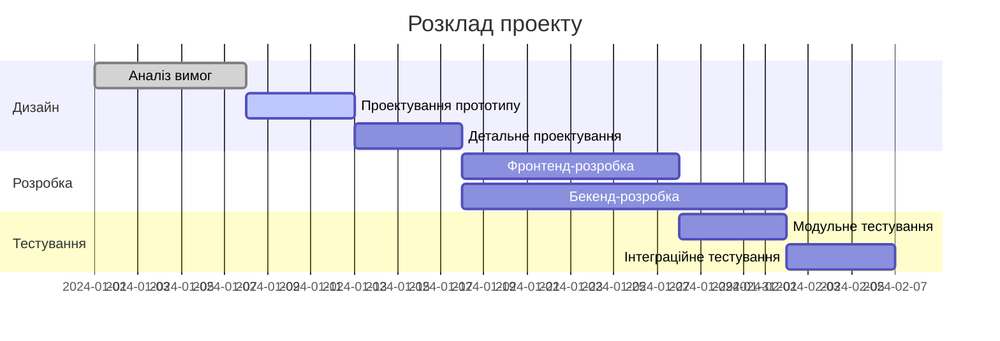
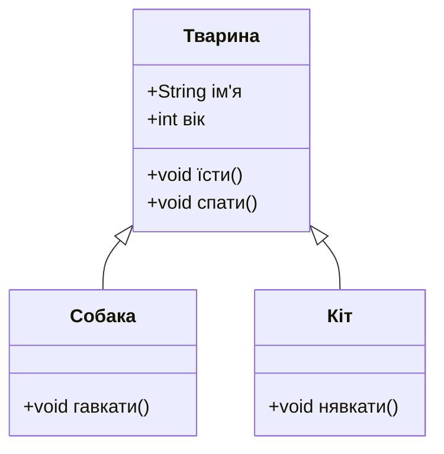
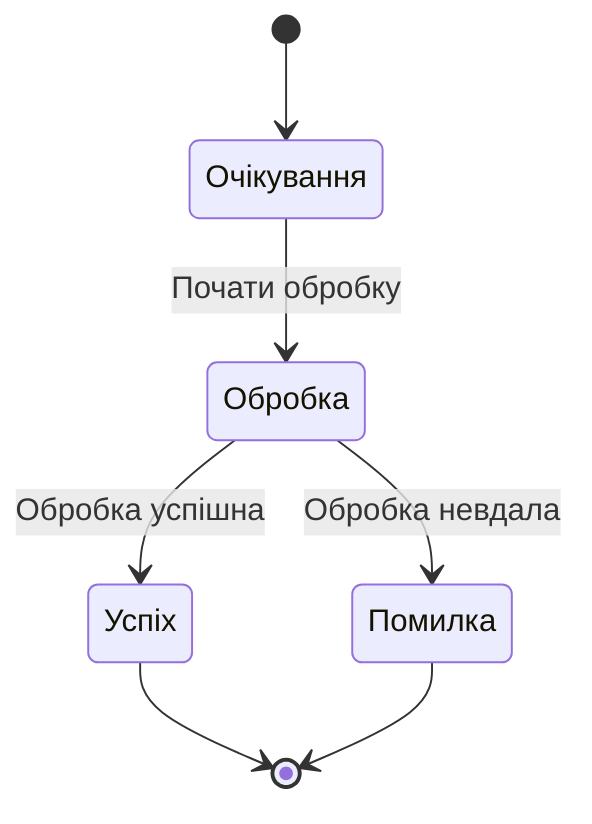
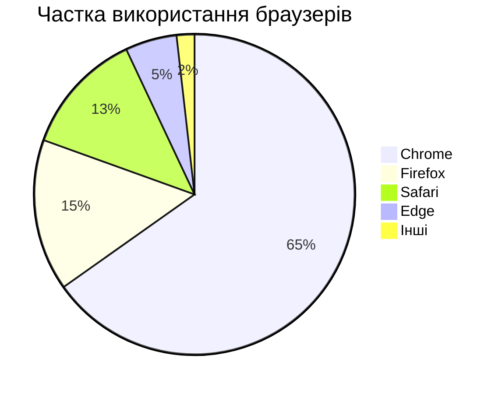

# Тестування діаграм Mermaid

Це тестовий файл для перевірки функціоналу відображення діаграм Mermaid у ZEN.

## Приклад блок-схеми



## Приклад діаграми послідовності



## Приклад діаграми Ганта



## Приклад діаграми класів



## Приклад діаграми станів



## Приклад кругової діаграми



## Тест з помилковою синтаксичною конструкцією (має відображати повідомлення про помилку)

```mermaid
graph TD
    A --> B
    // Тут відсутнє визначення стрілки
    C --> D
```

Цей тестовий файл містить різні типи діаграм Mermaid для перевірки коректної роботи інтеграції Mermaid у ZEN.
