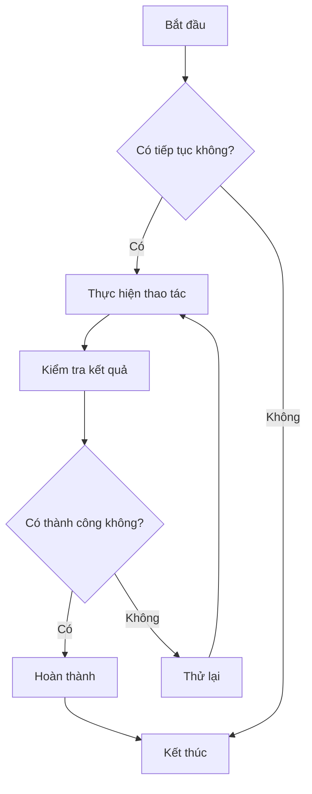
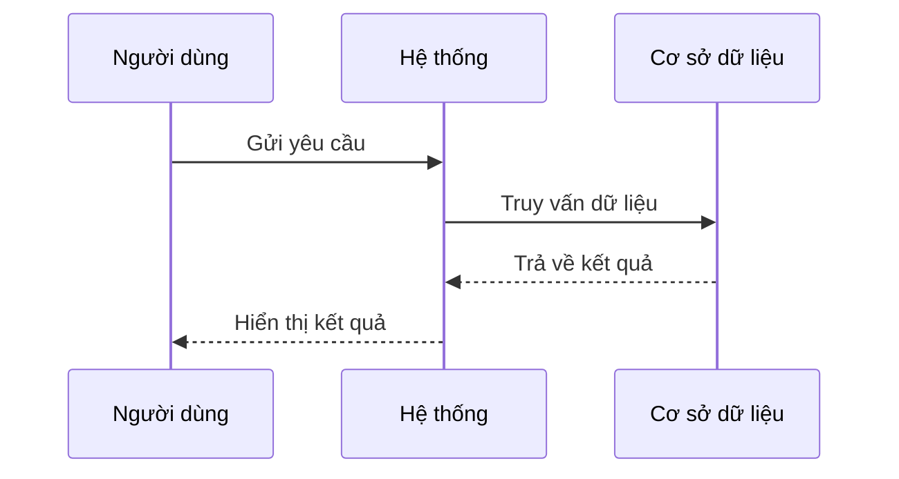
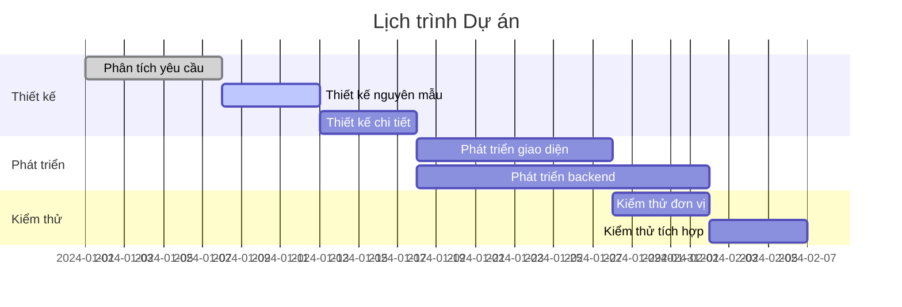
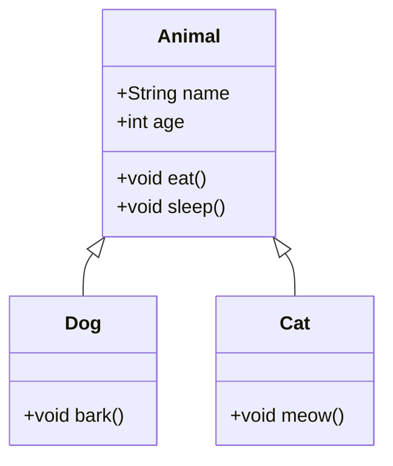
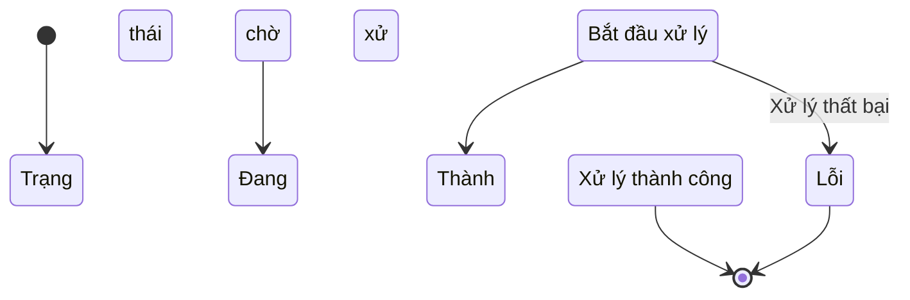
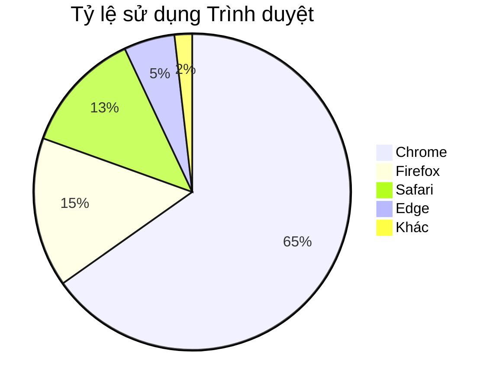

# Kiểm tra Biểu đồ Mermaid

Đây là một tập tin kiểm tra để xác minh chức năng hiển thị biểu đồ Mermaid trong ZEN.

## Ví dụ về Lưu đồ



## Ví dụ về Biểu đồ Tuần tự



## Ví dụ về Biểu đồ Gantt



## Ví dụ về Biểu đồ Lớp



## Ví dụ về Biểu đồ Trạng thái



## Ví dụ về Biểu đồ Tròn



## Kiểm tra Cú pháp Lỗi (Nên hiển thị thông báo lỗi)

```mermaid
graph TD
    A --> B
    // Thiếu định nghĩa mũi tên ở đây
    C --> D
```

Tập tin kiểm tra này bao gồm nhiều loại biểu đồ Mermaid khác nhau, được sử dụng để xác minh tích hợp Mermaid trong ZEN có hoạt động bình thường hay không.
